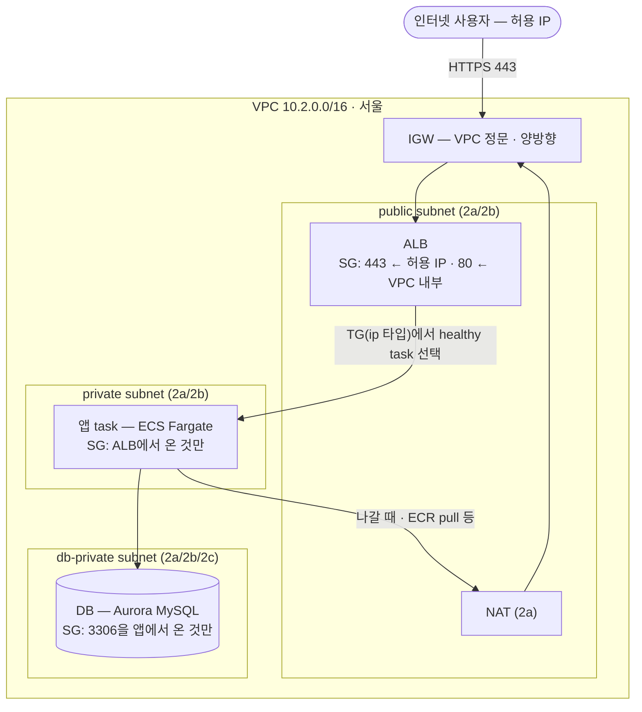
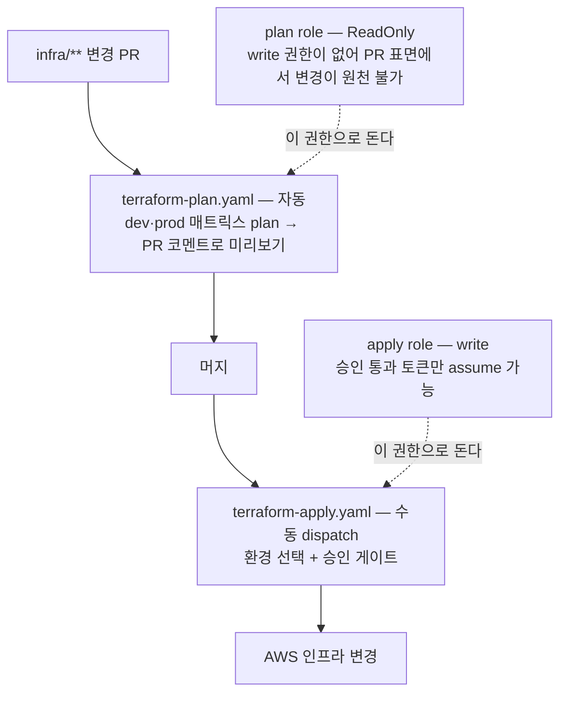

# Vercel에서 AWS로

> 관리자 페이지(Next.js)를 Vercel에서 AWS ECS Fargate로 옮긴 기록. 개념은 [개념 폴더](./개념/01-네트워크/01-vpc)에 있고, 여기는 **그 개념들이 실제로 어떻게 조립됐나**다.

## 1. 왜 옮겼나

단순 이관이 아니었다. 이유가 둘이다.

**① 보안 망분리** — Vercel은 공개 노출이 전제다. 관리자 페이지를 회사 VPC의 **private 서브넷에 격리**하려면 인프라를 직접 가져야 했다.

**② 이해와 소유** — Vercel이 플랫폼 뒤에서 공짜로 해주던 것들(캐시된 빌드·즉시 롤백·배포별 로그·모니터링)을 **우리 파이프라인이 직접 갖추고 이해**한다. "1년 뒤 봐도 이해되게."

②가 이 작업의 성격을 결정했다. 옮기는 내내 **"Vercel이 대신 해주던 게 뭐였나"** 를 하나씩 발견하게 된다 — 그게 [환경변수 세 갈래](./개념/03-컨테이너/04-env-secrets)였고, [이미지 크기](./개념/03-컨테이너/03-dockerfile)였고, [롤백의 전제](./배포-파이프라인#_3-sha-태깅-—-롤백의-전제)였다.

## 2. 도착 지점 — 요청 하나가 지나는 길



관리 접속은 이 그림에 안 보인다 — **ECS Exec**이 아웃바운드 443으로 AWS SSM에 붙는 방식이라, 들어오는 문이 하나도 없다.

**한 줄 목적**: 사용자 요청을 안전하게 받아 앱까지 전달하고, **앱·DB는 외부에서 안 보이게 숨기는** 구조.

- **VPC는 울타리, IGW는 그 정문**이다 — ALB·앱·DB는 전부 VPC **안**에 산다. 순서가 아니라 **포함** 관계고, hop 순서는 `사용자 → IGW → ALB → 앱 → DB`
- **외부에 보이는 건 ALB 하나**뿐이다. 앱과 DB는 private에 숨어 직접 보이지 않는다

::: warning SG와 TG는 완전히 다른 것이다
**TG(타깃 그룹)** = ALB의 배달 명단. "트래픽을 *어느 task로* 보낼까"(**분배**) + 헬스체크로 죽은 건 제외.
**SG(보안 그룹)** = 각 리소스의 경비. "*누가* 들어올 수 있나"(**보안**).

단계도 다르다 — ALB가 TG를 보고 보낼 곳을 고르고(분배), 도착하면 그 리소스의 SG가 들여보낼지 검사한다(보안).
:::

### 들어오는 길

```
① 외부 허용 IP → IGW(정문) → 진입
② → ALB (public 2a/2b)
     ALB SG는 포트 443 + 출발지 허용 IP 둘 다 맞아야 통과
③ → 앱 task (Fargate, private) — 두 가지가 동시에 일어난다
     보안(SG)   앱 SG는 출발지가 ALB SG인 것만 받는다
     분배(TG)   ALB는 ip 타입 TG에서 healthy task 하나를 고른다
④ → (필요시) DB (db-private)
     DB SG는 포트 3306 + 출발지 앱 SG 둘 다 맞아야 통과
     "그냥 3306이면 되는 게 아니라 앱 SG에서 와야" 한다 = SG 체이닝
```

### 나가는 길과 관리 접속

- **나갈 때**: 앱 task가 ECR 이미지를 받거나 외부 API를 호출할 때 → **앱 → NAT(public) → IGW → 인터넷**. NAT는 나가기 전용이라 외부에서 들어오는 연결은 막힌다
- **관리 접속**: [ECS Exec](./개념/04-보안/04-bastion-ssm#_8-ecs-fargate에서는-—-ecs-exec) — task가 아웃바운드 443으로 AWS SSM에 붙어 있고, 내가 IAM으로 접속한다. **열린 포트가 0개**다

### 보안 두 겹

```
1차  서브넷/라우팅   앱·DB는 private (라우팅에 0.0.0.0/0 → IGW 없음, → NAT)
                    → 외부에서 직접 진입 불가
2차  SG 체이닝       그 위에 "앞 계층에서 온 것만"
                    → 안에 들어와도 계층을 못 건너뛴다
```

**이 두 겹이 "망분리"라는 말의 실제 구현**이다. 외부에서 앱·DB에 직접 도달할 수 없고, 정문(ALB)을 거쳐 한 단계씩만 간다.

### 가용성과 비용의 선택

서브넷이 여러 AZ(2a/2b/2c)에 깔려 있어 ALB 2 AZ, RDS Multi-AZ로 한 AZ가 죽어도 유지된다. 환경마다 다르게 잡았다:

```
dev   비용 절감    NAT 1개(2a), RDS 단일 AZ
prod  안전 우선    NAT·RDS를 여러 AZ에 (비용이 더 들어도)
```

## 3. 무엇을 새로 만들고 무엇을 빌렸나

```
빌린 것 (data source로 발견)     VPC · 서브넷 · 클러스터 (백엔드 인프라가 만든 것)
새로 만든 것 (resource)          FE 전용 ALB · ECS 서비스 · ECR · IAM · Secrets · DNS · CloudWatch
```

**VPC를 재사용한 이유** — 새 VPC를 파면 백엔드 API 호출이 VPC 간 통신이 된다. 같은 VPC에 입주하면 사설 IP로 바로 닿는다.

**ALB는 왜 새로 팠나** — 백엔드 ALB를 공유하면 FE 설정 변경이 백엔드에 영향을 준다. **인프라 소유권 분리**가 이유다. 리스너 룰 하나 잘못 건드려 백엔드가 죽는 사고를 구조적으로 막는다.

**자체 DB가 없다** — 프론트라 백엔드 API를 호출할 뿐이다. DB 계층은 백엔드 몫이고, 우리는 [RDS 개념](./개념/01-네트워크/04-rds)만 알면 된다.

## 4. 순서 — 네 단계로 나눈 이유

```
1A  Terraform 인프라 코드 + dev apply     빈 그릇을 만든다 (ALB·ECS·ECR·IAM·Secrets·DNS·모니터링 8모듈)
1B  Dockerfile + 첫 배포                 그릇에 앱을 채운다 (health · 이미지 · OIDC · CI)
1C  preview + prod 환경                  파이프라인을 두 방향으로 확장한다
1D  Terraform CI/CD + 상시 dev           apply 자체를 CI로 옮긴다
```

### 각 단계에서 실제로 지은 것

**1A — 빈 인프라.** 8개 모듈(networking·secrets·iam·ecr·alb·ecs·dns·monitoring)을 짰다. 이 단계가 끝난 시점의 상태가 특이하다 — **ECS `desired_count=0`, ECR 비어 있음, health 엔드포인트 없음**. 즉 인프라는 섰는데 앱은 안 뜬다. 일부러다. 헬스체크가 실패하는 task를 미리 띄워봐야 503만 쌓인다.

**1B — 앱을 올린다.** 순서가 중요하다:

```
B0  health 엔드포인트     TG·컨테이너 헬스체크가 30초마다 부를 곳. 없으면 task가 명단에서 빠진다
B1  Dockerfile           멀티스테이지 + standalone → 214MB
B2  로컬 빌드·실행 검증    ECR에 올리기 전에 깨짐을 잡는다  ← 버그 2개를 여기서 잡았다
B3  ECR 수동 push + 첫 task
B4  OIDC role            장기 키 없이 CI가 AWS를 만지게
B5  CI 워크플로           머지 → 자동 배포
B6  secret 실제 값 주입
B7  롤백 검증
```

**"코드 먼저 짜두고, 인프라가 뜨면 배포 검증"** 이 이 단계의 패턴이었다. B0·B1·B2·B4·B5는 apply 권한과 무관하게 먼저 쓸 수 있고, B3·B6·B7만 실인프라를 기다린다.

**1C — 두 방향 확장.** preview를 prod보다 **먼저** 했다. preview는 prod에 기술 의존이 없고(dev ALB + 와일드카드 인증서가 1A에 이미 있다), 만든 날부터 팀이 매일 쓰지만 prod는 cutover 전까지만 준비되면 되기 때문이다.

**1D — apply를 사람 손에서 뗀다.** `terraform apply`를 DevOps 노트북에서 GitHub Actions(OIDC)로 옮겼다. PR에 plan을 코멘트로 붙이고, apply는 승인 게이트를 통과한 수동 dispatch로 돈다.



모든 role에 **permission boundary**(권한 천장)를 붙여 권한 상승을 차단한다.

[권한이 사람 손에서 통제된 자동화로 옮겨간다](./개념/04-보안/02-assume-role#_6-만드는-건-1회-입는-건-매번)는 원칙이 여기서 실현된다.

## 5. 전환(cutover) 설계 — 위험한 날을 좁히기

가장 위험한 순간은 **실사용자 트래픽이 Vercel에서 AWS로 넘어가는 날**이다. 그래서 그날 손대는 것을 최소화하는 쪽으로 설계를 뒤집었다.

### 시운전 무대를 prod로 앞당겼다

```
원안   이행기 동안 main → dev 자동 배포(시운전), cutover 날 prod로
문제   cutover 날 "아무도 안 밟아본 prod"에 실사용자를 처음 올리는 도박

변경   워크플로를 main → prod 단일 경로로 짓고,
       검증용 주소(new-admin)를 prod ALB로 먼저 연결
효과   시운전 무대가 prod 그 자체가 된다
       팀이 며칠간 prod를 실사용 검증 → cutover 날 바뀌는 건 "주소만 연결"뿐
대가   워크플로 머지부터 주소 교체까지 검증 주소가 수 시간 멈춘다 (수용)
```

### 인증서와 호스트 룰을 미리 어긋나게 둔다

[인증서가 보증하는 도메인과 ALB가 받아주는 도메인은 별개 축](./개념/02-트래픽/03-acm#_3-인증서가-보증하는-도메인-alb가-받아주는-도메인)이다. 이걸 이용해 **호스트 룰엔 실주소를 미리 넣고, 인증서엔 아직 안 넣는** 상태로 뒀다.

실주소가 아직 Vercel을 가리키니 트래픽이 안 오고, 미리 넣어둬도 무해하다. 그래서 cutover 당일 할 일이 **DNS CNAME 교체 + 인증서 재발급** 둘로 좁혀진다.

### 되돌릴 길을 남긴다

롤백 레버가 둘이고 용도가 다르다:

```
이미지 롤백    옛 SHA 태그로 재배포        "이번 배포분 코드가 문제"
CNAME 롤백     DNS를 옛 환경으로 되돌림     "환경 전체가 문제"
```

두 번째가 가능하려면 **옛 환경을 지우지 않고 재워둬야 한다**(`desired_count 0`). 깨우는 데 2~3분이면 된다.

## 6. 트러블에서 배운 것

이관 중 겪은 문제 7건은 코드 리뷰가 아니라 **첫 실전 머지에서** 나왔다. 종류별로 묶으면 배운 게 셋이다.

### ① 플랫폼이 주입하는 환경은 실제 무대에서만 드러난다

로컬 docker에서 멀쩡히 뜬 이미지가 ECS에서는 3.5분마다 죽었다. standalone 서버는 `HOSTNAME`을 **바인딩 주소**로 읽는데 ECS Fargate는 같은 이름을 **머신 이름**으로 자동 주입한다. 두 의미가 충돌했다.

**로컬 검증은 "이미지 자체의 결함"까지만 잡는다.** 로컬 docker는 플랫폼의 자동 주입을 재현하지 않는다.

### ② "우연히 되는 것"이 가장 위험하다

로컬 `~/.npmrc`가 registry 설정을 우연히 공급하고 있었고, 로컬 `.env`가 `PHASE` 변수를 우연히 공급하고 있었다. 둘 다 **내 머신에만 있는 파일**이 빌드를 살리고 있었다.

컨테이너는 그 우연을 제거해주는 **검증 장치**이기도 하다. 어차피 CI에서 터질 버그를 조기에 발견한 셈이다.

### ③ 녹색이 성공을 뜻하지 않는다

ECS의 circuit breaker가 실패한 배포를 자동 롤백하면, 복귀 후 서비스가 "안정" 상태라 **워크플로의 안정화 대기는 통과**한다. 서비스는 옛 버전인데 워크플로만 녹색인 **위장 녹색**이다.

그래서 배포 후 **revision 번호를 검증하는 단계**를 따로 넣었다. 녹색의 정의는 "워크플로 통과"가 아니라 **"의도한 revision이 실제로 떠 있음"** 이다.

## 한 줄 정리

- **왜 옮겼나**: 망분리(private 격리) + Vercel이 대신 해주던 것을 직접 갖고 이해하기
- **구조**: 외부에 보이는 건 ALB 하나, 앱·DB는 private. **private 서브넷 + SG 체이닝 = 두 겹 방어**
- **빌린 것과 만든 것**: VPC·서브넷은 재사용, ALB는 소유권 분리를 위해 신설
- **순서**: 빈 인프라 → 앱 올리기 → preview·prod 확장 → apply 자체를 CI로
- **cutover 설계의 핵심**: 위험한 날에 손댈 것을 최소화한다 — 시운전을 prod에서 미리, 룰은 미리 배치, 되돌릴 환경은 재워두기
- **배운 것**: 플랫폼 주입은 실무대에서만 드러나고, "우연히 되는 것"이 가장 위험하며, **녹색은 성공이 아니다**
