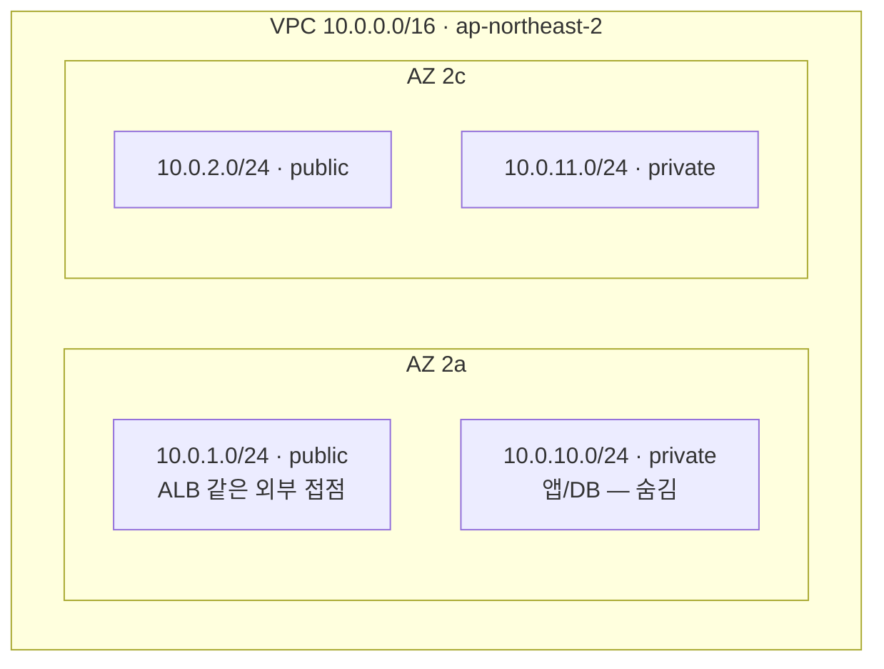

# VPC와 서브넷

> 이 문서가 토대다. [게이트웨이와 라우팅](./02-gateway-routing) · [가용성과 AZ](./03-availability-az)가 전부 여기 위에 얹힌다.

## 1. VPC — 격리된 가상 사설망

**VPC(Virtual Private Cloud)** = AWS 계정 안에 만든 격리된 가상 사설망. 내 리소스(EC2·ECS·RDS)가 들어가 사는 동네다. 비유하면 **모눈종이 땅 한 덩어리**.

- 하나의 IP 대역을 가진다 (`10.0.0.0/16` → 약 6.5만 개 IP)
- VPC 안의 리소스끼리는 **사설 IP로 통신**, 밖과는 **게이트웨이를 통해서만**(IGW/NAT)
- **리전 단위다** — VPC는 한 리전 안에만 존재한다. 서울(`ap-northeast-2`)에 만든 VPC는 도쿄(`ap-northeast-1`)에선 안 보인다

::: warning 리전 ≠ AZ
`ap-northeast-2a` · `2c` 처럼 **뒤에 글자가 붙은 건 AZ(가용영역)** — 리전(서울) 안의 개별 데이터센터다.
:::

쓰는 이유 셋: ① 격리(다른 계정·외부와 분리) ② 내부망 통신 ③ public/private을 나눈 보안 설계.

## 2. 서브넷 — 땅을 잘게 나눈 구획

**Subnet** = VPC의 IP 대역을 더 작게 쪼갠 구획. **각 서브넷은 하나의 AZ에 묶인다.**

- **AZ = 리전 안의 독립된 데이터센터(건물).** 전력·네트워크가 서로 분리돼 한 건물이 정전 나도 다른 건물은 멀쩡
- 비유: 리전 = 도시(서울), AZ = 그 도시에 떨어져 있는 데이터센터 건물 여러 채, 서브넷 = 한 건물 안의 IP 구획
- 그래서 서브넷을 **2개 이상 AZ에 깔면** 한 건물이 죽어도 서비스가 유지된다 (→ [가용성과 AZ](./03-availability-az))

**public / private을 가르는 진짜 기준은 이름이 아니라 라우팅 테이블이다:**

```
0.0.0.0/0 → IGW  경로가 있으면   → public
없으면 (또는 → NAT)              → private
```

서브넷엔 라우팅 테이블(트래픽 이정표)이 붙는데, 거기 "인터넷으로 가는 트래픽은 IGW로 보내라"는 줄이 **있으면 인터넷과 직접 통하고(public), 없으면 나갈 길이 없다(private)**. 이름표가 아니라 "인터넷 가는 길이 뚫렸나"가 핵심이다 (→ [라우팅 테이블](./02-gateway-routing#_2-라우팅-테이블-—-경로를-알려주는-이정표)).



같은 tier(public/private)를 **여러 AZ에 하나씩** 깔았다. 이 배치가 곧 이중화 설계다.

## 3. CIDR — IP 대역을 표기하는 법

`10.0.0.0/16` 같은 표기가 CIDR. **`/` 뒤 숫자 = 네트워크 비트 수**(고정된 앞부분).

IP는 총 32비트. `/16`이면 앞 16비트 고정, 뒤 16비트가 자유 → `2^16 = 65,536`개.

**주소 개수 = `2^(32 - prefix)`**

| CIDR  | 자유 비트 | 주소 개수  | 느낌                    |
| ----- | ----- | ------ | --------------------- |
| `/16` | 16    | 65,536 | VPC 통째 (큰 땅)          |
| `/20` | 12    | 4,096  | 큰 서브넷                 |
| `/24` | 8     | 256    | 흔한 서브넷 크기             |
| `/28` | 4     | 16     | AWS 서브넷 최소            |

숫자가 **작을수록 큰 대역**이다(`/16` > `/24`). 헷갈리면 "/뒤가 작으면 자유 비트가 많으니 넓다".

### 섞이기 쉬운 네 가지

```
CIDR        IP/prefix 표기 전체        10.0.0.0/16
프리픽스 길이   / 뒤 숫자 = 네트워크 비트 수   16
서브넷 마스크   프리픽스를 점 4칸으로        255.255.0.0
예약 주소     서브넷에서 못 쓰는 IP 5개     .0 .1 .2 .3 .255
```

`/24`와 `255.255.255.0`은 같은 말이다. `/16`은 **프리픽스 길이**지 예약 주소가 아니다.

### AWS는 서브넷마다 IP 5개를 예약한다

`/24`(256개)면 실제 쓸 수 있는 건 **251개**. 예약은 **범위의 맨 앞 4개 + 맨 끝 1개**:

```
10.0.1.0    네트워크 주소 (이 서브넷 자신을 가리키는 번호)
10.0.1.1    VPC 라우터   (이 서브넷의 출입 게이트웨이)
10.0.1.2    AWS DNS
10.0.1.3    미래 예약
10.0.1.255  브로드캐스트 (AWS는 안 쓰지만 예약)
            → 실제 사용 가능: 10.0.1.4 ~ 10.0.1.254
```

⚠️ 기준은 "어느 octet"이 아니라 **범위의 시작과 끝**이다. `/16`인 `10.2.0.0/16`이면 처음 `10.2.0.0`~`10.2.0.3`, 마지막 `10.2.255.255`. 그리고 **서브넷마다 각각** 적용된다 — `10.0.2.0/24`에선 `10.0.2.1`이 라우터다.

서브넷 CIDR은 **VPC CIDR 범위 안**이어야 한다. `10.0.0.0/16` 안에 `10.0.1.0/24`는 되고 `192.168.x`는 안 된다.

## 4. 사설 IP vs 공인 IP

| | 사설 IP (Private) | 공인 IP (Public) |
|---|---|---|
| 어디서 통함 | **VPC 내부망 안에서만** | **인터넷 전체에서** 라우팅 |
| 누가 줌 | 내가 VPC/서브넷에서 할당 | AWS/ISP가 발급 (희소·유료) |
| 대역 | `10.x` `172.16~31.x` `192.168.x` | 그 외 전부 |
| 외부 도달 | 불가 | 가능 |

VPC 내부 리소스는 기본적으로 사설 IP를 가진다. 그래서 밖으로 나가려면 IGW나 NAT가 필요하다. EC2는 재시작마다 공인 IP가 바뀌는데, **EIP(Elastic IP)** 를 붙이면 고정된다.

### 사설 IP 3대역 (RFC1918)

전 세계가 "인터넷에 안 내보내는 IP"로 약속한 범위. 크기가 제각각인 게 함정이다:

```
10.0.0.0/8      → 10.x.x.x              10은 통째로 사설
172.16.0.0/12   → 172.16.x ~ 172.31.x   172는 16~31만 사설  ← 빠뜨리기 쉬운 하나
192.168.0.0/16  → 192.168.x.x           192는 192.168만 사설
```

나머지 `172`·`192` 구간은 공인이다. 그래서 회사 VPC도 내 집 공유기도 같은 사설 대역을 자유롭게 쓴다 — 각자 사설망 안이라 인터넷으로 안 나가서 안 부딪힌다.

이 3개 대역은 RFC 표준이라 고정이지만, **그 안에서 내 VPC를 얼마로 자를지는 자유**다(AWS는 `/16`~`/28` 허용). 예: `10.0.0.0/8` 안에서 dev VPC는 `10.2.0.0/16`을 떼어 썼다.

## 5. 확인하는 법 — read-only로 실물 보기

생성 권한 없이 `describe`만으로 실제 VPC를 관찰할 수 있다.

```bash
# 우리가 올라탈 VPC와 CIDR
aws ec2 describe-vpcs \
  --filters "Name=tag:Project,Values=ishopcare" "Name=tag:Environment,Values=dev" \
  --query "Vpcs[].[VpcId,CidrBlock]" --output table

# 서브넷들의 CIDR + AZ
aws ec2 describe-subnets --filters "Name=vpc-id,Values=<VPC_ID>" \
  --query "Subnets[].[CidrBlock,AvailabilityZone,Tags[?Key=='Tier']|[0].Value]" --output table
```

나온 CIDR로 주소 개수를 직접 계산해보고(`2^(32-prefix)`), AZ가 서로 다른지 확인하면 이중화 설계가 보인다.

## 한 줄 정리

- **VPC = 격리된 모눈종이 땅(리전 단위), 서브넷 = 그 땅을 AZ별로 쪼갠 구획**
- **CIDR `/N` → 주소 `2^(32-N)`개. AWS는 서브넷당 5개 예약**
- **사설 IP는 내부망에서만 통한다 → 밖으로 나가려면 IGW나 NAT**
- **public/private은 이름이 아니라 라우팅(`0.0.0.0/0 → IGW`)이 결정한다**
