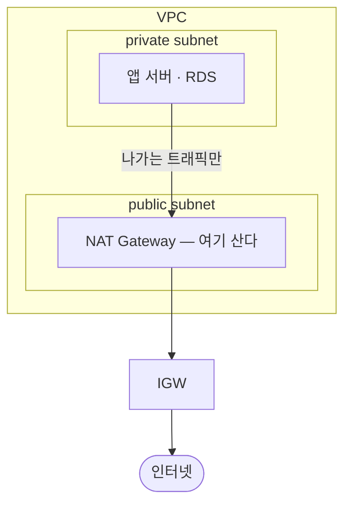

# 게이트웨이와 라우팅

> 토대: [VPC와 서브넷](./01-vpc). 이 문서의 질문: **VPC 안의 리소스가 어떻게 인터넷과 통하나?**

public 서브넷에 EC2를 띄웠는데 접속이 안 된다. 서브넷 이름을 public으로 지었는데도. 빠진 게 두 개다 — **출입구(IGW)** 와 **거기 가는 길(라우팅 테이블)**.

## 1. 인터넷 게이트웨이 — VPC의 출입구

**IGW(Internet Gateway)** = VPC와 외부 인터넷 사이의 출입구. Gateway를 직역하면 "출입구"다.

사람이 집에 문이 있어야 들락날락하듯, VPC도 IGW가 있어야 들락날락한다. **VPC에 붙인다**(서브넷이 아니라).

```
        인터넷
          │
     ┌────┴────┐
     │   IGW   │   ← VPC에 붙는 출입구
     └────┬────┘
   ┌──────┴──────────────────┐
   │  VPC                     │
   │   ├─ public subnet       │
   │   └─ private subnet      │
   └──────────────────────────┘
```

IGW는 **양방향**이다 — "외부 → 서브넷"도, "서브넷 → 외부"도 통한다.

## 2. 라우팅 테이블 — 경로를 알려주는 이정표

**트래픽을 어디로 보낼지 경로를 알려주는 표.** Routing = "길을 정하다".

IGW를 달았는데도 왜 안 통했나? **EC2는 IGW로 가는 방법조차 모르기 때문이다.** 컴퓨터는 똑똑하지 않다 — 나가야 한다는 건 알아도 어느 방향으로 트래픽을 보낼지 모른다. 그 방향을 적어둔 게 라우팅 테이블이고, **서브넷마다 하나씩 붙는다**.

```
대상(Destination)   타깃(Target)
10.0.0.0/16     →   local     VPC 내부는 사설 IP로 자기들끼리
0.0.0.0/0       →   igw-xxx   그 외 전부(= 인터넷)는 IGW로
```

- `local` = 사설 IP를 써서 네트워크 내부에서만 통신하라는 뜻
- `0.0.0.0/0` = 모든 IPv4 주소. 즉 "나머지 전부"

**두 규칙에 다 걸리면?** `10.0.0.5`는 `10.0.0.0/16`에도 `0.0.0.0/0`에도 해당한다. AWS는 **더 구체적인(prefix가 긴) 조건을 우선**한다 → `local`로 간다.

::: tip public 서브넷을 만드는 실제 순서
1. VPC 생성
2. 서브넷 생성 — EC2를 배치해도 아직 접속 불가
3. **IGW 생성 + VPC에 연결** — 출입구를 단다
4. **라우팅 테이블에 `0.0.0.0/0 → IGW` 추가** — 그 출입구로 가는 길을 알려준다

3번까지만 하고 안 된다고 헤매기 쉽다. 4번이 public 서브넷의 정의 그 자체다.
:::

## 3. NAT 게이트웨이 — 나가기 전용 출입구

private 서브넷엔 **IGW를 달면 안 된다.** IGW는 양방향이라 외부에서 들어올 수 있고, private의 존재 이유가 사라진다.

그런데 private에 있는 앱도 밖으로 나갈 일은 있다 — 외부 API 호출, 패키지 설치. 그래서 **나가는 방향만 뚫어주는 장치**가 NAT 게이트웨이다.

```
IGW    외부 → 서브넷  ✅     서브넷 → 외부  ✅     (양방향)
NAT    외부 → 서브넷  ❌     서브넷 → 외부  ✅     (나가기 전용)
```

방향이 하나뿐이라 **외부 해커가 들어올 경로 자체가 없다**. 보안상 훨씬 안전한 이유다.

### NAT는 public 서브넷에 둔다

헷갈리기 쉬운 지점. NAT는 VPC에 붙이는 것도, private 서브넷에 붙이는 것도 아니다 — **public 서브넷에 놓는다.**



NAT 자신은 인터넷과 통해야 하니 public에 있어야 하고, private의 트래픽은 NAT를 거쳐 IGW로 나간다. private 라우팅 테이블은 `0.0.0.0/0 → NAT`가 된다.

**private 서브넷을 인터넷에 직접 노출하지 않으면서도 인터넷 접근은 가능하게** 만드는 구조다.

## 한 줄 정리

- **IGW = VPC에 붙는 양방향 출입구**, 없으면 public 서브넷도 안 통한다
- **라우팅 테이블 = 그 출입구로 가는 길**, 둘 다 있어야 비로소 통한다
- **NAT = public 서브넷에 놓는 나가기 전용 출입구**, private이 밖으로만 나가게 해준다
- 규칙이 겹치면 **더 구체적인 prefix가 이긴다**
