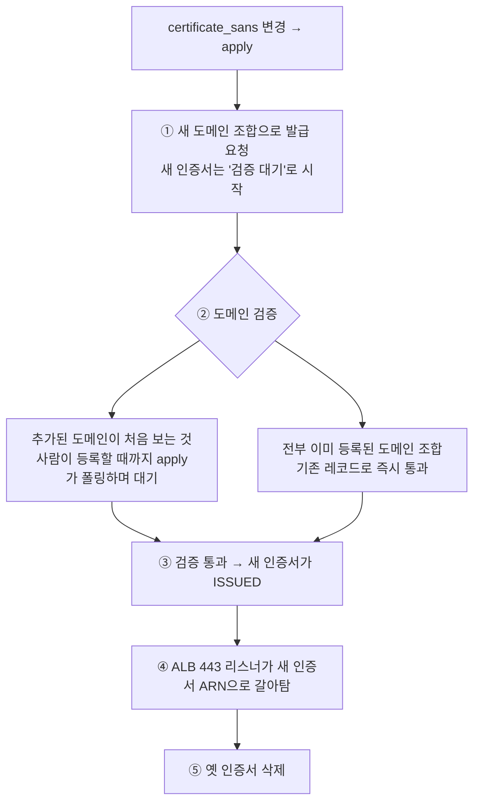

# ACM 인증서와 SAN

> 토대: [Route 53과 DNS](./01-route53) · [ELB와 ALB](./02-alb). 이 문서의 질문: **HTTPS 인증서 한 장이 어떻게 여러 도메인을 커버하나?**

## 1. 인증서가 하는 일 — "이 서버, 그 도메인 주인 맞아요"

브라우저가 `https://admin.example.com`에 접속하면 서버(우리 경우 ALB)가 인증서를 내민다. 브라우저는 두 가지를 검사한다:

1. **믿을 만한 기관(CA)이 서명했나** — ACM 인증서는 Amazon이 CA다
2. **이 인증서가 지금 접속한 도메인을 보증하나** — 인증서에 적힌 도메인 목록과 주소창 도메인을 대조

2번에서 도메인이 목록에 없으면 "주의 요함" 경고가 뜬다. **인증서 자체는 멀쩡해도 도메인이 안 맞으면 실패**라는 게 핵심이다.

## 2. 대표 도메인 + SAN — 한 장으로 여러 도메인

인증서에 적히는 도메인은 두 칸이다:

```
대표 도메인 1개   terraform aws_acm_certificate 의 domain_name
SAN 여러 개       subject_alternative_names 목록
                 (Subject Alternative Names, 주체 대체 이름)
```

브라우저는 **어느 칸이든 매치되면 통과**시킨다. SAN은 "이 인증서가 추가로 보증하는 도메인 목록"이고, 도메인마다 인증서를 따로 발급할 필요 없이 한 장으로 묶는 수단이다.

예를 들어 대표를 `new-admin.example.com`, SAN을 `*.new-admin.example.com`으로 두면 preview 주소(`pr-551.new-admin.*`)까지 한 장으로 커버된다.

## 3. 인증서가 보증하는 도메인 ≠ ALB가 받아주는 도메인

**"이 도메인의 HTTPS를 보증하나"(인증서)와 "이 도메인 요청을 어느 task로 보내나"(ALB 호스트 룰)는 별개 설정이다.** 섞기 쉬운데, 실패 증상이 다르니 구분해두면 디버깅이 빨라진다.

| 축 | 무엇을 정하나 | 변수 | 안 맞으면 |
|---|---|---|---|
| 인증서 | 그 도메인의 HTTPS를 보증할 수 있나 | `domain_name` + `certificate_sans` | 브라우저 인증서 경고 |
| ALB 호스트 룰 | 그 도메인 요청을 task로 넘기나 | `domain_name` + `extra_hostnames` | 404 (받아줄 룰이 없음) |

두 축이 코드에서 갈라지는 지점:

```hcl
# 인증서   (modules/alb/main.tf)
subject_alternative_names = certificate_sans

# 호스트 룰 (modules/ecs/main.tf)
host_header = concat([domain_name], extra_hostnames)
```

그래서 **한쪽에만 도메인을 넣어두는 것도 유효한 전략이다.** 예를 들어 호스트 룰엔 미리 넣고 인증서엔 아직 안 넣으면, "ALB는 받을 준비가 됐는데 인증서는 아직 없는" 상태가 된다. 트래픽이 아직 그 주소로 안 오는 동안 미리 배치해두면, 전환일에 손댈 것을 인증서 재발급 하나로 좁힐 수 있다.

## 4. 와일드카드는 1단계만

`*.new-admin.example.com`의 `*`는 **딱 한 단계**의 이름만 대신한다:

```
pr-551.new-admin.example.com      ✅  * = pr-551 (1단계)
a.b.new-admin.example.com         ❌  * 가 a.b 두 단계를 못 덮음 → 인증서 경고
```

preview 주소를 `pr-{N}.new-admin.*`처럼 **평탄한 1단계 구조**로 잡는 이유 중 하나가 이것이다. 와일드카드 한 장으로 PR 몇 번이든 커버하려면 단계가 하나여야 한다.

## 5. DNS 검증 — 그리고 2단계 apply

ACM은 인증서를 공짜로 발급해주는 대신 **"너 이 도메인 주인 맞아?"를 DNS로 증명**하라고 요구한다.

```
① terraform이 인증서 발급 요청
② ACM이 "이 CNAME을 DNS에 등록해봐" 라고 검증 레코드를 줌
   (_fcb6....new-admin.example.com → _88cb....acm-validations.aws)
③ DNS 등록
   - Route 53이면 terraform이 자동
   - 외부 DNS 호스팅이면 사람이 수동 등록   ← 여기서 사람이 낀다
④ ACM이 레코드를 확인하면 ISSUED(발급 완료) — 코드는 이걸 폴링하며 대기
```

③에 사람이 끼면 apply를 **두 번으로 나눠야 한다.** 1단계는 인증서만 만들어 검증 레코드 값을 뽑고(`-target=인증서`), 사람이 등록한 뒤, 2단계로 나머지 전체를 apply한다. 한 번에 돌리면 ④의 폴링이 "아직 등록 안 된 레코드"를 기다리며 멈춰 있게 된다.

### 검증 레코드는 인증서가 아니라 도메인에 딸린다

이 성질 하나가 재발급 비용을 크게 낮춘다. 검증 레코드의 이름·값은 ACM이 **"이 AWS 계정 + 이 도메인" 조합에서 계산**해 주는 것이라, 인증서를 새로 만들 때마다 새 레코드가 나오지 않는다.

```
인증서 A — 대표 new-admin.*, SAN *.new-admin.*
  new-admin.*    → 검증 레코드 _fcb6...new-admin 요구 → 등록
  *.new-admin.*  → 요구 레코드가 위와 동일 (와일드카드는 본 도메인과 같은 레코드) → 추가 등록 0

인증서 B — 대표 admin.*, SAN new-admin.*
  admin.*        → 검증 레코드 _xxxx...admin 요구 → 등록 (이것만 새로)
  new-admin.*    → 인증서 A 때와 동일 → 이미 등록돼 있어 즉시 통과
```

도메인 3개가 인증서 2장에 걸쳐 있어도, 등록하는 검증 레코드는 **도메인당 1개씩 총 2개**가 전부다.

### 검증 CNAME은 영구 보존

**자동갱신(13개월 주기)도 같은 레코드를 재확인한다.** 검증 CNAME을 지우면 당장은 멀쩡하다가 **1년 뒤 갱신이 실패해 인증서 만료 사고**가 난다. 운영 규칙으로 못 박아둘 것.

## 6. SAN 변경 = 재발급

두 층위를 구분해야 한다:

- **브라우저 입장에서 SAN 추가는 "새 장"이 아니다.** 인증서는 여전히 한 장이고, 그 안의 보증 도메인 목록이 늘어난다
- **그런데 ACM 입장에서는 SAN 변경 = 재발급이다.** 발급된 인증서는 내용을 못 고치는 불변 문서라, SAN을 바꾸면 새로 발급하고 옛것을 버리는 교체(replace)가 일어난다

apply로 따라가면:



④가 ③보다 먼저일 수 없다 — **검증 안 된 인증서는 ALB에 못 단다.**

### create_before_destroy가 막는 사고

교체가 필요한 변경에서 terraform의 기본 동작은 "옛것 삭제 → 새것 생성"이다. 인증서에서 그러면 옛것을 지운 순간부터 새것이 ISSUED 될 때까지 **ALB에 인증서가 없는 구간 = HTTPS 전면 장애**가 생긴다.

```hcl
lifecycle {
  create_before_destroy = true   # 새것을 먼저 ISSUED 시키고, ALB가 갈아탄 뒤 옛것 삭제
}
```

이 비용 구조 때문에 **SAN은 처음 설계에 넣는 쪽이 싸다.** 나중에 더하면 재발급 + 사람 등록 대기를 한 번 더 치른다.

## 7. 흔한 오해 교정

> "ACM은 한 번 발급하면 끝인데, SAN을 변경하면 검증값이 달라져서 다시 등록해야 한다"

절반만 맞다.

- ✅ **"SAN을 변경하면 인증서가 새로 발급된다"** — 맞다. 발급된 인증서는 불변이라 통째로 재발급된다
- ❌ **"인증서가 바뀌었으니 검증값도 달라져 전부 다시 등록해야 한다"** — 틀리다. 검증값은 인증서가 아니라 **도메인에 딸려 있다**
- 그래서 다시 등록할 대상은 **변경으로 처음 들어온 도메인 것뿐**이다. 기존 N개 + 새 도메인 1개면 등록 작업은 1개

한 문장으로: **인증서는 바뀌어도(재발급) 도메인의 검증 레코드는 안 바뀐다(재사용).**

## 8. 코드에서의 모습

```hcl
resource "aws_acm_certificate" "main" {
  domain_name               = var.domain_name        # 대표 도메인
  subject_alternative_names = var.certificate_sans   # SAN — tfvars가 환경별로 결정
  validation_method         = "DNS"                  # 검증 방식 = DNS 레코드

  lifecycle {
    create_before_destroy = true                     # 교체 시 새것 먼저 → 무중단
  }
}

# ISSUED 까지 폴링 대기 — 검증 레코드를 사람이 등록하는 동안 기다린다
resource "aws_acm_certificate_validation" "main" {
  certificate_arn = aws_acm_certificate.main.arn
  timeouts { create = "2h" }   # 수동 등록 + DNS 전파 여유
}
```

443 리스너는 **인증서 리소스가 아니라 `aws_acm_certificate_validation.main.certificate_arn`을 참조한다.** 이렇게 하면 "ISSUED 전에 ALB에 달리는" 순서 사고를 terraform 의존성 그래프가 차단해준다.

## 한 줄 정리

- **인증서 검사는 CA 서명 + 도메인 대조 둘.** 도메인이 목록에 없으면 인증서가 멀쩡해도 경고
- **대표 도메인 + SAN**으로 한 장이 여러 도메인을 보증한다. 와일드카드는 **1단계만**
- **검증 레코드는 도메인에 딸린다** — 재발급해도 기존 도메인 것은 재사용, 새 도메인 것만 등록
- **검증 CNAME 삭제 = 1년 뒤 만료 사고.** 영구 보존
- **SAN 변경은 재발급**이니 처음 설계에 넣는 쪽이 싸고, `create_before_destroy`로 교체 중 끊김을 막는다
