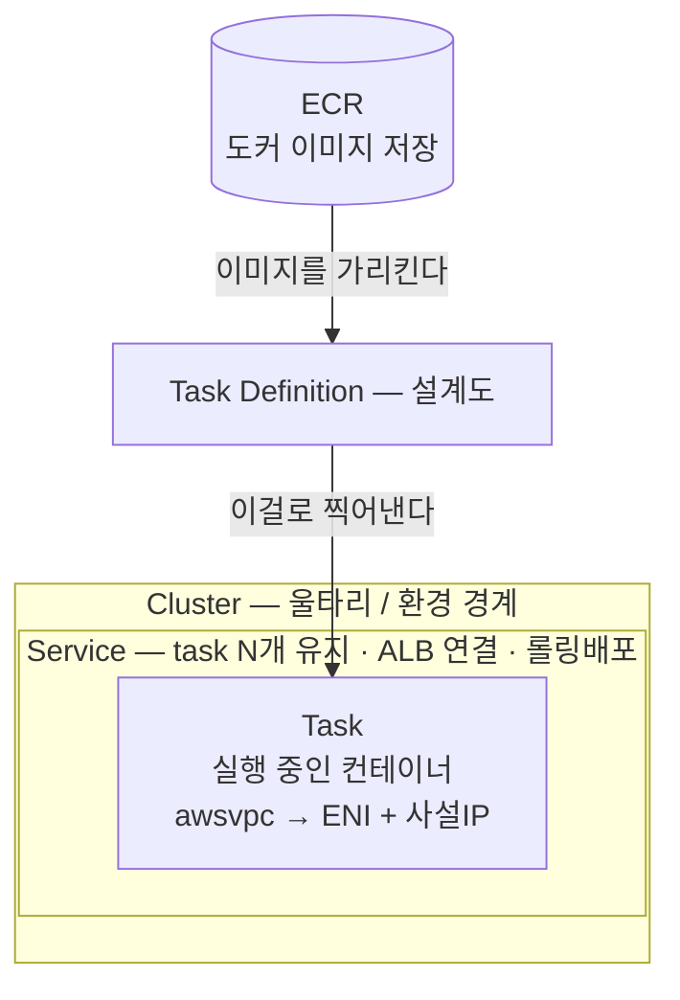
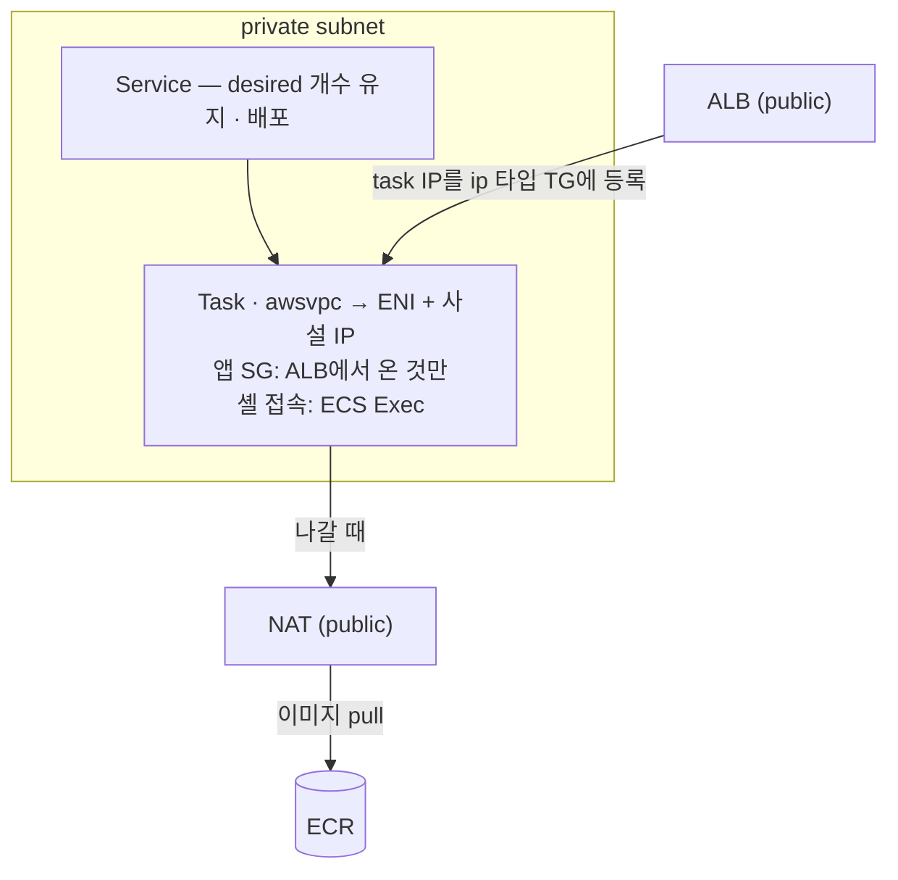

# ECS Fargate

> 토대: [ELB와 ALB](../02-트래픽/02-alb) · [보안 그룹](../04-보안/03-security-group) · [게이트웨이와 라우팅](../01-네트워크/02-gateway-routing). 이 문서의 질문: **Next.js 앱을 어떻게 컨테이너로 띄우고 유지·배포하나?**

## 1. ECS란

**ECS(Elastic Container Service)** = AWS의 컨테이너 실행·관리 서비스. 도커 컨테이너를 띄우고, 죽으면 다시 띄우고, 개수를 유지하고, 배포한다.

**Vercel이 해주던 "코드 올리면 알아서 띄우고 스케일·배포"를 AWS에선 ECS가 한다.**

## 2. 4층 구조

| 개념 | 무엇 | 비유 |
|---|---|---|
| **Task Definition** | 컨테이너 **설계도** — 이미지·CPU/메모리·포트·환경변수·IAM role | 붕어빵 **틀** |
| **Task** | 그 정의로 **실제 뜬 컨테이너 1개**. Fargate면 각자 ENI + 사설 IP | 틀로 찍은 **붕어빵 1개** |
| **Service** | task를 **원하는 개수 유지** + ALB 연결 + 롤링 배포 | 붕어빵 2개를 항상 유지하는 **점주** |
| **Cluster** | task/service들이 사는 **논리적 그룹** | **울타리** |



**짚어둘 것:**

- **ENI(Elastic Network Interface)** = 가상 랜카드. task가 VPC 안에서 IP를 갖고 통신하게 해준다. Fargate task마다 1개씩 붙어 사설 IP를 받는다
- **Task Def ≠ 도커 이미지.** 이미지(앱 + 실행환경, ECR에 저장)를 **Task Def가 가리킬 뿐**이다. Task Def는 "그 이미지를 어떤 사양·포트·env로 띄울지" 설계도다
- **Task Def vs Service.** Task Def = 설계도(무엇을), Service = 운영 정책(몇 개 유지·ALB 연결·배포 방식)
- **desired count** = Service가 유지할 task 개수 목표값. desired=2면 하나 죽어도 새로 띄워 2개를 맞춘다. `running`은 지금 실제 떠 있는 수
- **Task Definition은 등록할 때마다 버전이 붙는다** (`dev-dx:2` = 2번째 버전)

### Task Definition이 정하는 것

"이 컨테이너 하나를 띄우려면 알아야 할 것 전부"다.

| 항목 | 무엇 | 예 |
|---|---|---|
| **이미지** | 어떤 도커 이미지(ECR 주소) | `…/dev/dx:latest` |
| **CPU/메모리** | task에 줄 자원 | 512 / 1024 |
| **포트** | 컨테이너가 listen하는 포트 | 3000 |
| **환경변수** | NODE_ENV, API URL 등 | (앱 설정) |
| **IAM role** | 이 task가 AWS 리소스를 쓸 권한 | — |
| **networkMode** | 네트워크 방식 | awsvpc |
| **로그** | 로그를 어디로 보낼지 | CloudWatch |

붕어빵 비유로: 반죽=이미지, 크기=cpu/mem, 구멍=포트, 토핑=env, 출입증=role.

## 3. Fargate vs EC2 (launch type)

```
Fargate   서버리스. EC2 관리 없이 task만 띄운다. CPU/메모리만 정하면 밑단은 AWS가.
          task가 직접 private subnet에 ENI를 받고 뜬다
EC2       내가 EC2들을 직접 띄워 그 위에 task를 배치 → 서버 관리 부담
```

Fargate를 쓰면 **EC2 인스턴스가 아예 없다.** 그래서 SSH로 들어갈 서버도 없고, 셸이 필요하면 ECS Exec를 쓴다 (→ [Bastion과 SSM](../04-보안/04-bastion-ssm)).

::: tip launchType이 None으로 보인다면
capacity provider(FARGATE) 방식을 쓰면 `launchType`이 `None`으로 조회된다. 여전히 Fargate다.
:::

## 4. 배운 네트워크와 어떻게 붙나



- Fargate task는 ENI+IP를 가지니 **`ip` 타입 TG**로 ALB에 등록된다
- task는 **private 서브넷** + **앱 SG**(ALB SG에서 온 것만 허용)
- 나갈 때는 **NAT**를 거쳐 ECR에서 이미지를 pull한다
- Service가 desired count를 유지하고 ALB 헬스체크와 연동해 죽은 task를 교체한다 = 가용성

## 5. 배포 흐름

```
코드 → 도커 이미지 빌드 → ECR(이미지 저장소)에 push
     → 태스크 정의 새 버전 → 서비스가 롤링 배포
       (새 task 띄움 → 헬스체크 통과 → 옛 task 제거)
```

**롤링 배포** = 한 번에 다 바꾸지 않고, 새 task가 healthy로 확인되면 옛것을 내린다 → 무중단.

## 6. 실물로 확인 (2026-06-05)

`ishopcare-dev-cluster`의 서비스 3개는 전부 Fargate, desired=running=1이다.

| 서비스 | task def | 비고 |
|---|---|---|
| dev-rookie-api-service | `dev-ishopcare-rookie-api:146` | API |
| dev-dx-service | `dev-dx:2` | API (포트 3000) |
| dev-ishopcare-retool-server-service | `dev-ishopcare-retool-server:1307` | retool |

`dev-dx` 태스크 정의: cpu `512` / mem `1024` / networkMode `awsvpc` / FARGATE, 이미지 `…/dev/dx:latest`, 포트 3000.

포트 3000이 [ALB의 `dev-dx-tg`](../02-트래픽/02-alb#_4-실물로-확인-—-dev-alb-2026-06-04)(3000, `/api/health`)와 맞물린다 — **서비스 ↔ TG ↔ ALB** 연결이 여기서 확인된다.

```
[ALB alb-ishopcare-dev]  Listener → Rule
        │
        ▼
[dev-dx-tg]  포트 3000 · 헬스체크 /api/health · ip 타입
        ▲  (task IP 등록)
        │
[dev-dx-service] ─ Task(dev-dx:2) ─ awsvpc · 포트 3000 · 이미지 …/dev/dx:latest
```

```bash
aws ecs list-clusters --query "clusterArns[]" --output text
aws ecs list-services --cluster <CLUSTER> --query "serviceArns[]" --output text

aws ecs describe-services --cluster <CLUSTER> --services <SVC> \
  --query "services[].[serviceName,launchType,desiredCount,runningCount]" --output table

aws ecs describe-task-definition --task-definition <FAMILY> \
  --query "taskDefinition.{cpu:cpu,mem:memory,net:networkMode,images:containerDefinitions[].image}" --output json
```

## 한 줄 정리

- **ECS** = AWS의 컨테이너 실행·관리(= Vercel의 배포 역할 대체). 4층: **Cluster ⊃ Service ⊃ Task(← Task Def 설계도)**
- **Fargate** = 서버리스라 EC2 인스턴스가 없다. task가 private 서브넷에 직접 뜬다
- **Service가 개수를 유지**하고 헬스체크와 엮여 죽은 task를 교체한다
- **배포** = 이미지 ECR push → 서비스 롤링 배포(헬스체크 통과 시 교체)
