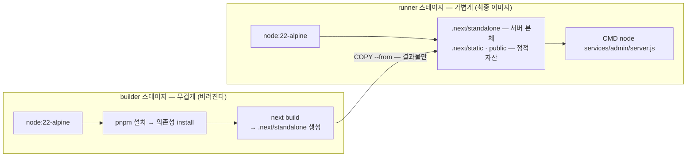

# Dockerfile과 Next.js standalone

> **한 줄:** Vercel이 자동으로 해주던 "소스 → 실행 가능한 앱" 변환을 Dockerfile이라는 레시피로 직접 적었다. 핵심 두 수는 **멀티스테이지**(빌드 주방과 서빙 접시를 분리)와 **Next.js standalone**(실행에 진짜 필요한 파일만 추적해 담기) — 이 둘로 이미지가 3GB급에서 **214MB로 92% 줄었다**(실측). 그리고 "로컬에서 docker로 돌려봤다"가 끝이 아니라는 것도 배웠다.

## 1. 문제 — 빌드 도구까지 통째로 배달할 셈인가

앱을 **빌드**하려면 pnpm·전체 소스·devDependencies가 다 필요하다. 그런데 **실행**할 때는 그게 다 필요 없다.

한 단계로 이미지를 만들면 빌드 도구까지 전부 담겨 수 GB가 되고, 그 크기만큼 ECR pull·배포·롤백·preview 기동이 전부 느려진다 (→ [이미지 크기 = 배포 속도](./02-ecr#_5-몰랐던-것-→-교정된-이해)).

### 해결 1 — 멀티스테이지

Dockerfile 안에 단계를 둘로 나눈다:



builder에 있던 pnpm·소스·devDependencies는 **거기 두고 버린다.** 최종 이미지에는 빌드 도구가 0개다.

두 스테이지의 실패 양상이 다르다:

```
builder 실패   빌드 실패 → 이미지 자체가 안 만들어짐 (배포 중단, 서비스는 무사)
runner 실패    static·public 복사 누락 → 앱은 뜨는데 CSS·이미지가 깨짐
               추적 root 잘못      → MODULE_NOT_FOUND
```

### 해결 2 — standalone

`next.config.ts`에 `output: 'standalone'`을 켜면, Next가 빌드 산출물에서 출발해 **import 사슬을 따라가며 "실제로 쓰이는 파일"을 수집**해 `.next/standalone/`에 담는다.

여기서 `server.js`는 standalone이 **자동 생성하는 Next.js 내장 프로덕션 서버**다 (내가 작성하는 파일이 아니다). 그래서 runner가 `node server.js` 한 줄로 뜬다 — `next start`도, 전체 node_modules도 불필요하다.

```
standalone 없이 node_modules 통째 복사   2.8GB → 이미지 ~3GB급
standalone 적용                          214MB   (약 14배, 92% 감량)
```

## 2. 모노레포의 함정 — outputFileTracingRoot

위의 "import 사슬 따라가기"는 **추적 시작점(root)** 아래에서만 파일을 찾는다. 시작점을 안 적으면 Next가 root를 **자기 폴더**(`services/admin`)로 잡아서, 모노레포 루트에 있는 pnpm 구조(`.pnpm`)와 workspace 패키지를 **놓친다** → standalone이 불완전해지고 runner에서 `MODULE_NOT_FOUND`로 죽는다.

```ts
// services/admin/next.config.ts
output: 'standalone',
outputFileTracingRoot: path.join(__dirname, '../../'),  // 모노레포 루트부터 추적
```

따라오는 디테일 둘:

- **산출 경로도 루트 기준이 된다** — `server.js`가 `services/admin/server.js`로 들어가므로 CMD 경로도 그것
- **정적 자산은 standalone에 안 들어간다** (Next 설계 — CDN으로 따로 서빙하라는 가정) → `.next/static`과 `public/`을 runner에 수동 복사해야 한다. 안 하면 앱은 뜨는데 CSS·이미지가 깨진다

## 3. Dockerfile의 순서가 곧 빌드 속도 — 레이어 캐시

Docker는 명령 단계별로 캐시하고, **한 단계가 바뀌면 그 아래는 전부 다시** 돈다. 그래서 "잘 안 바뀌는 것 먼저, 자주 바뀌는 것 나중" 순서가 캐시 적중률을 정한다:

```
① COPY 매니페스트만 (pnpm-workspace.yaml, package.json, lockfile, .npmrc)
② RUN pnpm install --frozen-lockfile        ← 느린 단계
③ COPY 소스
④ RUN next build
```

소스만 고친 커밋은 ③부터 다시 돌고 ②(느린 설치)는 캐시를 재사용한다. 순서를 바꾸면(소스 먼저) 커밋마다 재설치다.

- **빌드 컨텍스트는 모노레포 루트다** — lockfile·catalog·공용 패키지가 다 루트에 있어 앱 폴더만으로는 못 굽는다. 루트에서 `docker build -f services/admin/Dockerfile .`
- **`.dockerignore`가 컨텍스트 전송량을 정한다** — 루트가 9GB인데 `node_modules`·`.next`·`.git`을 제외하면 **19MB**만 Docker 데몬에 전송된다(실측). 어차피 컨테이너 안에서 새로 설치·빌드하니 보낼 이유가 없다

## 4. 로컬 검증에서 잡은 함정 셋 — "되겠지"는 전부 틀렸다

ECR push 전에 로컬에서 `docker build → run → curl /api/health`를 돌리는 단계에서 셋이 터졌다. 전부 추측으로는 못 봤을 부류다.

### ① pnpm 10의 registry 설정 위치 (404 사태)

install 도중 일부 패키지를 공개 npm에서 받으려다 404. lockfile에는 받을 URL이 안 박혀 있어 **설치 시점의 설정**이 registry를 정하는데, **pnpm 10은 그 설정을 `.npmrc`에서만 읽는다** — `pnpm-workspace.yaml`에 있던 `registry:` 줄은 pnpm 10이 아예 안 읽는 죽은 설정이었다.

로컬은 개인 `~/.npmrc` 덕에 "우연히" 동작했고, 컨테이너엔 그게 없어 기본값(공개 npm)으로 흘렀다. 해결은 우회가 아니라 **SSOT 교정** — 루트 `.npmrc`를 커밋하고 Dockerfile이 COPY → 로컬·CI·Docker가 같은 설정 하나를 본다.

### ② localhost의 IPv6 함정

`localhost`라는 이름은 IPv4(`127.0.0.1`)와 IPv6(`::1`) 양쪽으로 풀릴 수 있는데, **alpine의 wget은 IPv6를 먼저 시도한다.** standalone 서버는 IPv4(`0.0.0.0`)에만 listen하고 IPv6는 열지 않으므로 거부된다.

무서운 건 파급이다 — **ECS 컨테이너 헬스체크 명령이 `localhost`로 적혀 있었다.** 그대로 apply했으면 헬스체크 영구 실패 → task 무한 재시작이었다. terraform을 `127.0.0.1`로 수정.

### ③ .env가 이미지에 구워짐

시크릿 유출 경로와 숨은 빌드 의존이 함께 드러났다. 전말은 [환경변수와 시크릿](./04-env-secrets#_5-갈래-2-부속-—-env-우선순위와-env의-함정)에 있고, 여기선 **"COPY가 `.env`를 집어간다 → `.dockerignore`에 `**/.env*`"** 만 기억하면 된다.

베이스 이미지도 실측 중 교정했다 — node 20으로 시작했다가 **Node 20이 2026-04 EOL**(보안 패치 종료) + `@types/node`가 22라는 정합 문제로 `node:22-alpine`으로 교체·재검증.

## 5. 몰랐던 것 → 교정된 이해

- **"로컬 docker 통과 = ECS 통과"가 아니다.** 로컬에서 멀쩡히 뜬 이미지가 ECS에서는 3.5분마다 죽었다 — standalone의 `server.js`는 기동 때 `HOSTNAME` env를 **바인딩 주소**로 읽는데, ECS Fargate는 같은 이름의 변수를 **머신 이름**이라는 의미로 자동 주입한다. 두 의미가 충돌해 서버가 pod IP에만 바인드됐다. 로컬 docker는 이 자동 주입을 재현하지 않는다.
  → **로컬 검증은 "이미지 자체의 결함"까지만 잡고, 플랫폼이 주입하는 환경의 결함은 실제 무대에서만** 드러난다
- **"우연히 되는 것"이 가장 위험하다** — 로컬의 `~/.npmrc`(함정 ①), 로컬의 `.env`(함정 ③) 둘 다 "내 머신에만 있는 파일"이 빌드를 우연히 살리고 있었다. 컨테이너는 그 우연을 제거해주는 검증 장치이기도 하다
- **기동 속도의 근거**: standalone 이미지의 기동 실측이 `Ready in 328ms`. 214MB pull + 1초 미만 기동이라 preview의 "수 분 내 재생성" 설계가 성립한다 (→ [PR Preview 환경](../../배포-파이프라인#_5-pr-preview-환경))

## 6. 비유

- **멀티스테이지** = **주방과 서빙 접시의 분리** — 오븐·반죽·도구가 있는 주방(builder)에서 굽고, 손님에겐 완성된 빵(runner)만. 주방을 통째로 배달하지 않는다
- **standalone** = **이삿짐 추적 포장** — "집을 돌리는 데 실제로 쓰는 물건만" 추적해 싸는 것. 추적 시작점을 잘못 잡으면 옆방(workspace 패키지) 짐이 빠진다
- **레이어 캐시** = **밀키트 공정** — 재료 손질(의존성 설치)을 미리 해두면, 레시피(소스)만 바뀌었을 때 손질부터 다시 안 한다

## 한 줄 정리

- **멀티스테이지 + standalone = 3GB급 → 214MB (92%)** — 이미지 크기는 곧 pull·배포·롤백 속도다
- 모노레포에선 **`outputFileTracingRoot: '../../'`가 생명** — 없으면 workspace 패키지가 빠져 `MODULE_NOT_FOUND`
- Dockerfile 순서 = 캐시 전략: **매니페스트 → install → 소스 → build**
- 로컬 검증으로 **잡는 것(registry·IPv6·.env)과 못 잡는 것(ECS의 env 주입)** 을 구분하라
