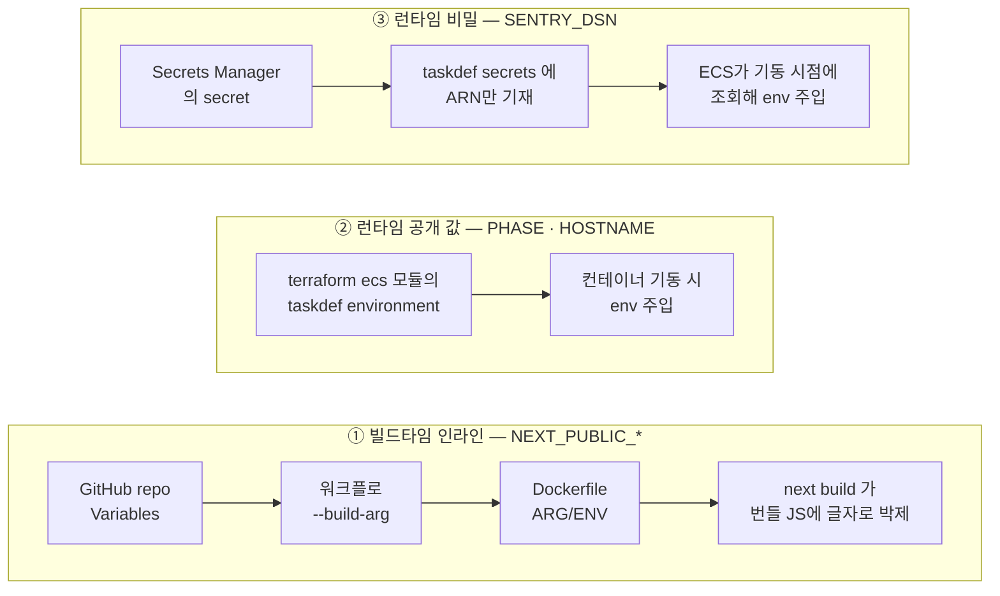

# 환경변수와 시크릿 지도

> **한 줄:** Vercel에서는 대시보드에 변수를 적으면 끝이었다. 그 한 칸이 사실은 세 갈래 — ① 빌드 순간 코드에 박제되는 값(`NEXT_PUBLIC_*`) ② 컨테이너 기동 때 꽂아주는 공개 값 ③ 기동 때 금고에서 꺼내오는 비밀 — 였고, AWS에서는 **갈래마다 주입 경로를 직접 지어야 한다.** 이관 중 겪은 트러블 7건 중 3건이 전부 이 지도의 빈칸에서 터졌다.

## 1. Vercel 대시보드 한 칸이 숨기고 있던 것

Vercel에서 환경변수는 key=value를 적으면 빌드에도 들어가고 런타임에도 들어갔다 — **언제 어떻게 들어가는지 구분할 필요가 없었다.** AWS로 오면서 그 "언제 어떻게"를 전부 직접 구성해야 했고, 안 한 곳마다 장애가 났다:

```
빌드 주입을 안 함           → 외부 연동 스크립트가 화면에서 사라짐
런타임 변수의 의미 충돌      → task가 3.5분마다 죽는 무한 교체
비밀 값 주입 단계를 빠뜨림   → prod task가 기동조차 못 함
```

## 2. 지도 한 장 — 세 갈래의 출발지와 도착지



| 갈래 | 성질 | 실패하면 |
|---|---|---|
| ① 빌드타임 | 박제 후엔 못 바꾼다 — 바꾸려면 재빌드뿐 | 값이 빈 채로 박제 → **그 기능이 조용히 죽는다**(에러 없음) |
| ② 런타임 공개 | 같은 이미지가 환경마다 다르게 도는 메커니즘 (build-once의 짝) | `getPhase()`가 "알 수 없는 환경" throw → SSR 페이지가 죽는다 |
| ③ 런타임 비밀 | 값은 코드·git·state 어디에도 없다 — AWS 안에만 | 값이 비면 `ResourceInitializationError`로 **기동 자체를 못 한다** |

**같은 변수 이름이 두 갈래에 다 있을 수 있다** — `NEXT_PUBLIC_SENTRY_DSN`(①, 브라우저용)과 `SENTRY_DSN`(③, 서버용)은 별개 경로다.

## 3. 갈래 ① — NEXT_PUBLIC은 빵 반죽에 넣는 재료

`NEXT_PUBLIC_*`는 **빌드하는 순간 번들 코드 안에 글자로 박힌다**(인라인). 브라우저에서 도는 코드는 서버 env를 읽을 수 없으니, Next.js가 빌드 때 `process.env.NEXT_PUBLIC_X`라는 글자를 실제 값으로 치환해버린다.

**Vercel 대시보드가 해주던 이 빌드 주입을 CI docker build에서는 아무도 안 하고 있었다.** 증상이 교묘했다 — 빌드도 배포도 녹색인데 외부 연동 스크립트만 안 뜨고, 브라우저 Sentry 요청이 0개. 해결은 경로를 직접 잇기: repo Variables → 워크플로 `--build-arg` → Dockerfile `ARG`+`ENV`.

::: tip "0개 = 고장"이 아닐 수 있다
그 Sentry 요청 0개는 사실 고장이 아니었다 — `enabled: phase === 'live'` 조건의 **의도된 꺼짐**(dev라서). 단정하기 전에 의도인지 확인할 것.
:::

**이 갈래의 운영 규약 — 환경별로 값이 갈리는 설정은 NEXT_PUBLIC 금지.** 갈리면 이미지를 환경 수만큼 구워야 해서 build-once가 깨진다.

## 4. 갈래 ③ — 그릇과 값의 분리, 그리고 분리의 함정

Secrets Manager의 secret(`frontend/{env}/sentry-dsn`)은 terraform이 만들지만 **그릇만** 만든다 — 이름·설명·ARN까지만 정의하고 값은 코드에 안 적는다.

### 왜 그릇만인가

terraform의 state(코드 ↔ 실제 리소스 매핑을 기억하는 파일)는 S3에 **평문 JSON**으로 저장된다. terraform이 다루는 모든 속성값이 state에 기록되므로, **값을 코드나 변수로 넣으면 그 비밀이 state에 평문으로 남는다.** 그래서 역할을 나눈다:

| 역할 | 담당 | 시점 |
|---|---|---|
| 그릇 (이름·ARN·접근권한) | terraform | apply 때 |
| 값 넣기 | 사람 (콘솔 또는 `aws secretsmanager put-secret-value`) | 환경 신설 후 1회 |
| 값 꺼내 쓰기 | ECS (taskdef secrets의 ARN 보고 기동 시 조회) | task 기동마다 |

이름을 `admin-*`이 아니라 `frontend/{env}/sentry-dsn`으로 둔 이유 — **FE 서비스들이 전부 같은 DSN 값을 쓴다.** 서비스별로 복제하면 같은 값이 여러 벌 생긴다. 공유 1개로 두면 타 서비스 이관 때 이 ARN을 그대로 참조하면 끝이다.

### 분리된 단계는 체크리스트에 둘 다 적혀야 한다

prod를 켜자(task 0→1) `ResourceInitializationError`로 기동이 무한 실패했다. `frontend/prod/sentry-dsn`이 **빈 그릇**(값 버전 없음)이었다. dev 때는 핸드오프 체크리스트에 "secret 값 주입" 단계가 있었는데, prod용 체크리스트를 새로 쓰며 누락된 것이다.

**그릇/값 분리는 의도된 설계지만, 분리된 단계는 체크리스트에 둘 다 적혀야 한다** — "환경 신설 = secret 값 주입 동반"을 고정 항목으로 승격.

## 5. 갈래 ② 부속 — env 우선순위와 .env의 함정

### env 우선순위

같은 변수를 여러 곳에서 정의하면 **뒤가 이긴다**:

```
Dockerfile ENV  <  ECS 런타임 자동 주입  <  taskdef environment
```

ECS Fargate가 `HOSTNAME`을 pod 호스트명으로 자동 주입해 Next.js standalone의 바인딩 주소를 덮어쓴 사고에서, `Dockerfile ENV HOSTNAME=0.0.0.0`으로는 못 막았고 **taskdef environment 레벨**에 박아야 이겼다.

### .env 파일의 함정 둘

1. **`.env`가 이미지에 구워진다** — `COPY services/admin/`이 로컬 `.env`를 빌더에 넣고, Next standalone이 `.env`를 산출물에 복사한다. ECR에 올리면 **pull 권한자 누구나 시크릿을 추출**할 수 있다. → `.dockerignore`에 `**/.env*` 추가
2. **`.env`가 숨은 빌드 의존을 가린다** — `.env`를 빼자 빌드가 "알 수 없는 환경"으로 실패했다. `getPhase()`가 요구하는 `PHASE`를 로컬 `.env`가 **우연히** 공급하고 있던 것. `.env`는 gitignore라 CI에는 없으니 어차피 CI 첫 빌드에서 터질 버그를 조기 발견한 셈이다. → Dockerfile `ARG PHASE=dev`(빌드 기본값) + taskdef environment(런타임 환경별 값)로 명시화

## 6. 비유

- **갈래 ①** = **빵 반죽에 넣는 재료** — 구운 뒤엔 못 바꾼다. 바꾸려면 다시 굽기
- **갈래 ②** = **서빙 직전에 곁들이는 소스** — 같은 빵을 매장(환경)마다 다르게 낸다
- **갈래 ③** = **금고** — 금고 설치와 열람 규칙(IAM)은 설계도(terraform)로, 현금 넣기는 주인이 직접 1회, 꺼내 쓰는 건 직원(ECS 기동)이 매번

## 한 줄 정리

- 환경변수는 한 종류가 아니다 — **빌드타임 인라인 / 런타임 공개 / 런타임 비밀** 세 갈래, 주입 경로가 전부 다르다
- ① NEXT_PUBLIC은 박제: Variables → build-arg → ARG/ENV. **환경별로 갈리는 값은 금지**(build-once 전제)
- ③ 비밀은 **그릇(terraform)과 값(사람 1회)의 분리** — state 평문 노출 방지. 빈 그릇이면 task가 아예 안 뜬다
- 우선순위는 **taskdef environment가 최종 승자** — Dockerfile ENV는 ECS 자동 주입에도 진다
- `.env`는 이미지에 구워지고(시크릿 유출) 숨은 의존을 가린다(CI에서 폭발) — `.dockerignore` 필수
