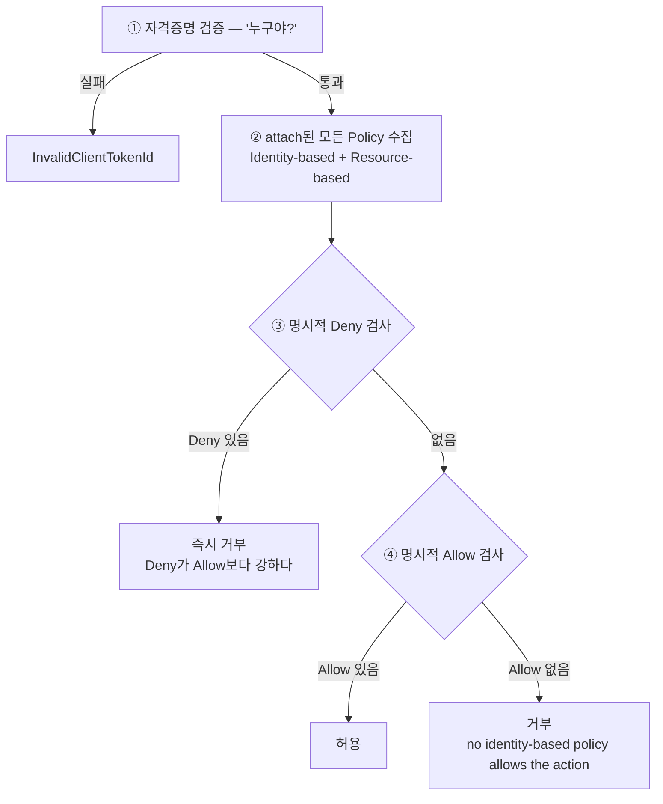

# IAM 기초

> **IAM(Identity and Access Management)** = AWS의 권한 관리 시스템. 이 문서의 질문: **`AccessDenied`가 떴을 때 어디를 봐야 하나?**

## 1. IAM 4종 — 상하 계층이 아니라 3개 축

흔한 오해: "User > Role > Group > Policy 같은 상하 관계". **실제는 3개 축**이다.

```
축 1: 신원 (WHO)         축 2: 묶음            축 3: 권한 명세
─────────────────        ──────────           ────────────────
User  (영구, 사람)        Group (User들 묶음)   Policy (JSON 문서)
Role  (임시, 빌려 씀)                          └ 위 셋에 attach 가능
```

| 개념 | 정체 | 비유 |
|---|---|---|
| **IAM User** | 영구 사용자. Access Key를 가진다 | 회사 정규 사번 |
| **IAM Role** | 임시 역할. 사람·서비스가 잠시 빌려 쓴다 | 가운 (입었다 벗을 수 있다) |
| **IAM Group** | User들의 묶음 | 부서 |
| **IAM Policy** | 권한 명세 (JSON) | "어느 사무실에 들어갈 수 있나" 규칙서 |

**관계에서 짚을 것 셋:**

- **User와 Role은 같은 계층이다.** 둘 다 "신원 주체"고, 차이는 영구냐 임시냐
- **Group은 User만 묶는다.** Role은 Group 멤버가 될 수 없다
- **Policy는 계층이 아니다.** 독립 객체로 존재하고 신원에 붙는다

### "attach"가 무슨 말인가

`attach` = **붙이다.** Policy는 그 자체로 존재하는 독립 객체이고, "이 User에게 붙임" / "이 Role에 붙임"으로 권한이 부여된다.

```
Policy     = 자격증 (예: 운전면허)
User/Role  = 사람
attach     = "이 사람에게 운전면허 부여"
```

같은 Policy를 여러 신원에 붙일 수 있어 **재사용**된다. `AmazonECS_FullAccess` 하나를 여러 Role에 붙이면 모두 같은 ECS 권한을 갖는다.

**같은 User라도 attach된 Policy가 바뀌면 권한이 달라진다** — 진짜 권한 정보는 Policy가 담는다.

## 2. Policy JSON 구조

```json
{
  "Version": "2012-10-17",
  "Statement": [
    {
      "Effect": "Allow",
      "Action": ["s3:GetObject", "s3:ListBucket"],
      "Resource": "arn:aws:s3:::my-bucket/*"
    }
  ]
}
```

| 필드 | 의미 |
|---|---|
| `Version` | 항상 `"2012-10-17"` (다른 값은 거의 없다) |
| `Statement` | 권한 규칙 배열. 여러 개 가능 |
| `Effect` | `Allow` 또는 `Deny` |
| `Action` | 어떤 AWS API 작업. `service:ActionName` 형식, 와일드카드 가능(`s3:*`) |
| `Resource` | 어떤 리소스에 대해. ARN 또는 `"*"`(전부) |
| `Condition` | (선택) 추가 조건 — 특정 IP에서만, 특정 시간만 등 |

### 읽는 법

> **"[Resource]에 대해 [Action]을 [Effect]한다"**

3요소 = **무엇을**(Action) + **어디에 대해**(Resource) + **어떻게**(Effect).

| JSON | 자연어 |
|---|---|
| `Allow s3:GetObject on my-bucket/*` | my-bucket 안의 모든 객체에 대해 읽기를 허용한다 |
| `Allow ec2:* on *` | 모든 EC2 리소스에 대해 모든 EC2 명령을 허용한다 |
| `Deny iam:DeleteRole on *` | 모든 IAM Role에 대해 DeleteRole을 거부한다 |

**WHO는 Statement 안에 없다.** Policy가 attach된 신원이 WHO 역할을 한다.

```
누가(WHO)      무엇을(Action)      어디에(Resource)       어떻게(Effect)
attach된 신원   s3:GetObject       arn:aws:s3:::xyz      Allow / Deny
```

## 3. 권한 평가 4단계

AWS가 명령을 받았을 때 이 순서로 판정한다:



**이 4단계가 `AccessDenied` 추적의 지도다.**

### AccessDenied를 만나면 볼 것 셋

```
사용자: arn:aws:sts::<계정ID>:assumed-role/DeveloperAccessGoogleSamlRole/me@example.com
작업:  iam:ListPolicies
컨텍스트: no identity-based policy allows the action
```

이 메시지를 4단계에 대보면:

- **자격증명**은 통과했다 ✓ — AWS가 누구인지 정확히 식별했다
- **작업**은 `iam:ListPolicies`
- **결과**는 ④에서 실패 — 어느 Policy에도 이 작업을 Allow하는 Statement가 없었다

그래서 원인 추적에 필요한 건 **사용자 ARN(누구) / Action(뭘 하려 했나) / Resource(어디에 대해)** 셋이다.

## 4. managed policy "Full"의 함정

같은 IAM 서비스인데 `iam:ListRoles`는 되고 `iam:ListPolicies`는 안 되는 일이 생긴다. 왜?

**attach된 다른 Policy 중 하나가 `iam:ListRoles`를 부분 허용하기 때문이다.** 예를 들어 `AmazonECS_FullAccess`는 ECS 작업 시 IAM role을 읽어야 하므로 `iam:GetRole`·`iam:ListRoles` 같은 일부 IAM 권한을 포함한다.

**"Full"이라는 이름이 붙어도 정확히 어떤 권한이 들어 있는지는 JSON을 직접 봐야 안다.** 실제로 어떤 권한이 쓰였는지는 IAM Access Advisor로 추적할 수 있다.

## 5. 권한 경계를 직접 확인하는 법

```bash
# 내 role에 붙은 policy 목록
aws iam list-attached-role-policies --role-name <ROLE_NAME>

# 되는지 안 되는지 직접 쳐본다
aws iam list-roles --max-items 1       # IAM 일부는 되기도
aws elbv2 describe-load-balancers      # EC2FullAccess 안에 ELB 포함
aws acm list-certificates              # 별도 권한이 없으면 AccessDenied
aws route53 list-hosted-zones          # 마찬가지
```

권한 경계를 문서로 추측하지 말고 **실제로 쳐보는 게 빠르다.** managed policy의 "Full"이 어디까지인지는 이 방법이 아니면 안 드러난다.

## 한 줄 정리

- **IAM 4종은 상하 계층이 아니다** — 신원(User·Role) / 묶음(Group) / 명세(Policy) 3개 축
- **Policy는 독립 객체**고 신원에 attach된다. 진짜 권한 정보는 Policy가 담는다
- **Policy 읽는 법: "[Resource]에 대해 [Action]을 [Effect]한다."** WHO는 attach된 신원이다
- **평가 4단계: 자격증명 → Policy 수집 → Deny 검사 → Allow 검사.** Deny가 Allow보다 강하다
- **managed policy "Full"은 이름으로 판단 못 한다** — JSON을 보거나 직접 쳐봐야 안다
