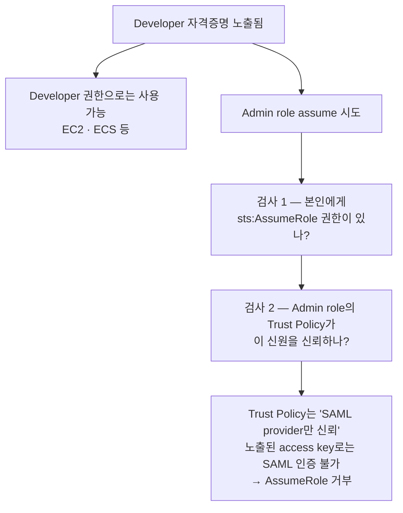
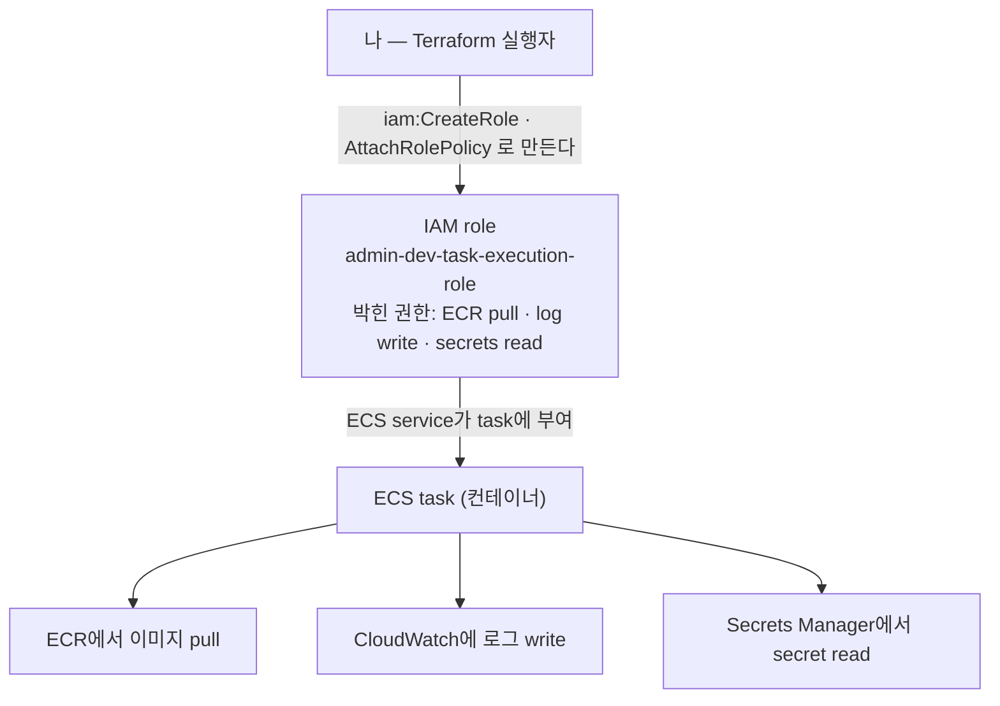

# 역할 빌리기와 SSO

> 토대: [IAM 기초](./01-iam). 이 문서의 질문: **왜 평소 권한과 강한 권한을 나누고, 그게 정말 안전한가?**

## 1. AssumeRole — 역할 빌리기

자기 User/Role의 권한이 부족할 때, **다른 Role을 임시로 가장**해서 그 권한으로 작업한다.

::: tip assume를 한글로
"가정/추정"(suppose)이 아니라 **"역할을 빌리다 / 입다"** 쪽 뜻이다. 가운을 입었다 벗는 비유 그대로. 그래서 `sts:AssumeRole`은 "역할 빌리기라는 API 작업이자 그 권한 이름"이다 (AWS는 API 1개 = 권한 이름 1개로 대응한다).
:::

```bash
aws sts assume-role \
  --role-arn arn:aws:iam::<계정ID>:role/AdminAccessGoogleSamlRole \
  --role-session-name my-temp-session
```

**성립 조건 둘:**

- 그 role의 **Trust relationship**에 "이 신원이 assume 가능"으로 명시돼 있어야 한다
- 본인에게 `sts:AssumeRole` 권한이 있어야 한다

**쓰는 이유:** 평소엔 약한 권한(Developer)이라 안전하고, 위험 작업 때만 강한 권한(Admin)을 임시로 쓰고, 만료되면 자동 회수된다. 자격증명이 노출돼도 평소 권한이 약해 피해가 작다.

## 2. "자격증명 털리면 결국 같은 거 아냐?"

자주 드는 의심: *본인이 AssumeRole 가능하면, 노출된 자격증명도 AssumeRole로 강한 권한을 얻을 수 있는 거 아닌가?*

**아니다. 격리된다.**



핵심은 **Role의 Trust Policy가 "누가 assume 가능한지"를 명시**한다는 것이다. 강한 role은 보통 SSO 사용자만 신뢰하므로, 평범한 access key로는 그 검사를 통과하지 못한다.

**자격증명 노출 = 그 자격증명의 권한까지만.** AssumeRole 자동 체인은 없다. 이게 권한 분리가 실제 보안 가치를 갖는 이유다.

## 3. "그래도 이게 정말 좋은 방식인가?"

후속 의심: *강한 권한 입구가 Google 하나로 모이면, 결국 Google 계정만 안 털리면 되는 거 아닌가?*

### "Google만 지키면 OK?" — 거의 맞다, 100%는 아니다

강한 권한으로 가는 문이 **SSO 게이트 하나**로 좁혀지니 방어선이 한 곳에 집약된다. 그래서 그 계정(+MFA)만 잘 지키면 강한 권한은 안전하다.

⚠️ 단, **평소 Developer 권한 범위 안의 피해**(EC2 띄우기, 일부 데이터 읽기)는 토큰만 털려도 가능하다. 정확히는 "강한 권한은 막히고, 약한 권한 범위의 피해는 가능"이다.

### 분리 안 한 세상과 대조하면 명백하다

| | 분리 안 함 (평소에도 Admin 영구 키) | 분리 + AssumeRole |
|---|---|---|
| 토큰 유출 시 | **즉시 계정 전체 장악** (전 리소스 삭제·유출) | Developer 권한만 (피해 제한) |
| 만료 | 없음 → 무한정 악용 | 1~12h 자동 만료 |
| 강한 권한 입구 | 아무 데서나 | SSO 게이트 1곳 (MFA·이상탐지 집중) |
| 감사 | 추적 어려움 | "누가 언제 Admin 빌렸나" 로그 |

좋은 이유 넷: **① 폭발 반경 축소 ② 시간 제한 ③ 방어 집중(열쇠 100개 < 정문 1개) ④ 감사 추적.**

**정직한 단점:** SSO 계정이 단일 실패점(SPOF)이 된다 → 그래서 MFA가 필수다. 본질은 "분리가 안전을 만든다"가 아니라 **"방어를 한 곳에 모아 거길 강하게 지킬 수 있게 한다"** 이다.

> 일상 비유: 지갑엔 현금 조금(Developer), 큰돈은 은행 금고(Admin). 지갑이 털려도 조금만 잃고, 금고는 지문 인증(SSO)을 거쳐야 열리며, 금고 문이 하나(은행 정문)라 거기에 경비를 집중한다.

## 4. SSO · SAML · STS의 관계

용어부터:

- **SAML** (Security Assertion Markup Language) — SSO 표준 프로토콜. "Google에서 로그인했다"를 AWS가 신뢰하게 만드는 표준 메시지 형식. 비유하면 **도장 찍힌 회사 신분증**
- **STS** (Security Token Service) — AWS의 **임시 자격증명 발급소**. SSO도 AssumeRole도 내부적으로 STS가 처리한다. 비유하면 **게이트 카운터의 임시 출입증 발급**

```
사용자
  │ SSO 로그인
  ▼
IdP가 SAML assertion 발급 ──► AWS STS
  │ "이 사람 진짜야 (도장 찍힌 신분증)"
  ▼
AWS STS가 sts:AssumeRoleWithSAML 실행
  │ "신분증 확인했어. 어느 role 줄까?"
  │ → SAML 안에 "DeveloperAccessGoogleSamlRole 줘"
  ▼
임시 자격증명 발급 (1~12시간 유효)
  │
  ▼
CLI/콘솔이 이 임시 토큰으로 동작
  ARN: arn:aws:sts::...:assumed-role/DeveloperAccessGoogleSamlRole/...
                        ↑ "이 role을 가장한 상태"
```

**SSO 로그인 = SAML을 통한 AssumeRole이 한 번 일어나는 것**이다. 그래서 내 ARN에 `assumed-role`이 들어 있고, "내 계정"이 아니라 "내가 가장한 Role"이 보인다.

## 5. "내 권한"과 "task의 권한"은 다른 차원

가장 헷갈리는 지점. **두 종류의 권한이 분리돼 있다.**

| | 누구 | 무엇 | 권한 예시 |
|---|---|---|---|
| **차원 1 (나)** | Terraform 실행자 | 사원증을 **만들고 권한을 박는** 권한 | `iam:CreateRole`, `iam:AttachRolePolicy` |
| **차원 2 (task)** | ECS task | 사원증에 박힌 **실제 출입 권한** | `ecr:GetAuthorizationToken`, `logs:PutLogEvents`, `secretsmanager:GetSecretValue` |



코드로 보면 두 차원이 한 파일에 나란히 있다:

```hcl
resource "aws_iam_role" "task_execution" {
  name = "admin-dev-task-execution-role"
  # ← 이 role을 만들려면 [나]에게 iam:CreateRole 이 있어야 한다
  assume_role_policy = jsonencode({...})
}

resource "aws_iam_role_policy_attachment" "ecr" {
  role       = aws_iam_role.task_execution.name
  # ← [나]에게 iam:AttachRolePolicy 가 있어야 한다
  policy_arn = "arn:aws:iam::aws:policy/service-role/AmazonECSTaskExecutionRolePolicy"
  # ← 이 정책 안의 "ECR pull, log write" 권한은 [task]가 쓴다. [나]와 무관
}
```

한 줄로: **"나는 사원증을 발급하는 사장. 사원증의 권한은 사원이 쓴다."**

이 분리가 없으면 어느 쪽이든 안 돈다:

```
나에게 iam:CreateRole 없음        → role을 못 만듦 → 컨테이너가 쓸 role이 없음
task role에 ECR pull 권한 없음    → role은 있지만 이미지를 못 받음 → 기동 실패
```

## 6. "만드는 건 1회, 입는 건 매번"

시점을 나누면 헷갈림이 풀린다:

```
role 만들기 + 권한 박기   →  1회 (terraform apply 때 딱 한 번). 이후 role은 계속 존재
role 입기(assume)         →  task가 뜰 때마다 (런타임, ECS가 자동). 사람이 할 일 없음
```

사원증은 **한 번 발급**하고, 출근(task 시작)할 때마다 그 증으로 게이트를 통과한다.

**"다 만들면 만들 권한은 필요 없나?" — 거의 맞지만 완전히 0은 아니다:**

| 권한 종류 | 언제 필요 |
|---|---|
| 쓰기 (`CreateRole`·`AttachRolePolicy`·`DeleteRole`) | role을 **만들/바꿀/지울 때만** |
| 읽기 (`GetRole`) | Terraform이 계속 관리하는 한 **상시** (plan의 drift 감지) |

task에 새 권한을 추가하거나, prod 환경 role을 신설하거나, role을 지울 때 다시 필요해진다.

### 그래서 권한은 사람에서 자동화로 옮겨간다

```
단기 (구축기)    만드는 동안만 강한 권한을 빌리고 반납 → "다 만들면 끝"이 맞다
장기 (CI/CD)     Terraform이 인프라를 계속 관리하니 IAM 권한이 상시 필요
                 단 그건 사람이 아니라 CI/CD 자동화가 보유한다 (→ OIDC)
```

**인프라가 자리 잡을수록 권한은 "사람 손" → "통제된 자동화"로 옮겨간다.** 사람은 점점 약한 권한만 갖고, 강한 권한은 파이프라인이 잠깐씩 쓴다 (→ [GitHub OIDC](./05-oidc)).

## 한 줄 정리

- **AssumeRole = 역할 빌리기.** Trust Policy가 "누가 빌릴 수 있나"를 명시한다
- **자격증명 노출 = 그 자격증명의 권한까지만** — AssumeRole 자동 체인은 없다
- **SSO 로그인 = SAML을 통한 AssumeRole 1회.** 그래서 ARN에 `assumed-role`이 찍힌다
- **"내 권한"과 "task의 권한"은 다른 차원** — 나는 사원증을 발급하고, 사원증의 권한은 task가 쓴다
- **만드는 건 1회, 입는 건 매번.** 그리고 그 "만들 권한"은 결국 사람에서 자동화로 넘어간다
