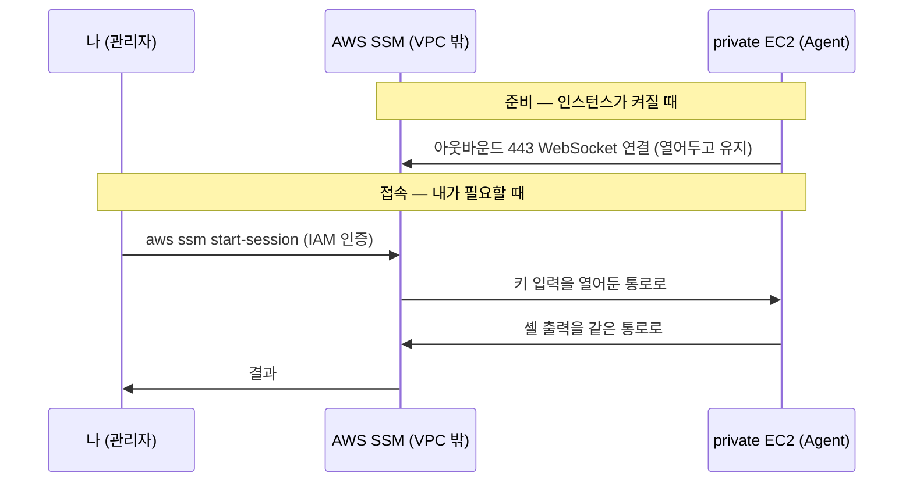

# Bastion과 SSM

> 토대: [VPC와 서브넷](../01-네트워크/01-vpc) · [게이트웨이와 라우팅](../01-네트워크/02-gateway-routing). private 서브넷은 외부에서 직접 못 들어간다 — **그럼 관리자는 어떻게 접속하나?**

## 1. 먼저 깔고 — 인바운드 vs 아웃바운드

```
인바운드(inbound)    밖 → 안으로 들어오는 연결   "외부가 내 서버로 접속"
아웃바운드(outbound)  안 → 밖으로 나가는 연결     "내 서버가 외부로 접속"
```

**방화벽은 "누가 연결을 *시작*하느냐"만 통제한다.** 그리고 **한 번 열린 연결에서 데이터는 양방향**으로 흐른다 — 시작 방향과 무관하게.

이 두 줄이 SSM 이해의 전부다.

## 2. 문제 — private 서브넷은 직접 못 들어간다

private 서브넷 리소스는:

- **공인 IP가 없다** → 인터넷에서 찾아갈 주소가 없다
- 라우팅에 `0.0.0.0/0 → IGW`가 없다 → **들어올 길도 없다** (그게 망분리다)

그런데 운영하려면 들어가야 한다(DB 쿼리, 서버 디버깅, 로그). 방법은 둘이다.

## 3. Bastion Host — 점프 서버

**실체**: public 서브넷에 둔 작은 EC2 한 대. 공인 IP가 있고 SG에 SSH(22) 인바운드를 허용한다.

**동작**: 내가 bastion에 먼저 SSH로 들어가고, 거기서 다시 private 리소스로 SSH한다. 한 번 갈아타서 "점프"다.

```
내 노트북 ──SSH 22(인바운드)──▶ Bastion(public) ──SSH(사설IP)──▶ private EC2
```

**단점이 구체적이다:**

- SSH 22가 **인터넷에 열려 있다** → 포트 스캔·무차별 대입·SSH 취약점에 직접 노출
- **SSH 키 관리** 부담 (분실·유출)
- bastion EC2가 **상시 떠 있어 비용**이 들고, 그 자체가 관리 대상이 된다

## 4. SSM Session Manager

**한 줄 정의: 포트를 하나도 안 열고도, IAM 권한만으로 private 인스턴스의 셸을 여는 AWS 기능.** Bastion 같은 별도 서버도, SSH 키도, 공인 IP도 필요 없다.

```bash
aws ssm start-session --target i-xxxx
```

이 한 줄로 private 인스턴스의 셸이 열린다 — 외부에 문을 하나도 안 열고. 원리는 **인스턴스가 스스로 밖으로 AWS SSM에 연결을 걸어두고, 나도 AWS SSM에 붙으면 AWS SSM이 둘을 이어주는** 것이다.

### AWS SSM의 실체 — 관리형 서비스, 진짜 주소가 있다

**내가 띄우는 게 아니라 AWS가 24/7 운영하는 관리형 서비스**다. S3·EC2 API처럼 AWS 인프라의 일부다.

추상적인 게 아니라 리전마다 **진짜 공개 엔드포인트**가 있다:

```
ssm.ap-northeast-2.amazonaws.com
ssmmessages.ap-northeast-2.amazonaws.com
ec2messages.ap-northeast-2.amazonaws.com
```

"외부의 SSM" = 내 VPC 밖, AWS가 관리하는 영역에 항상 켜져 있는 이 주소들이다.

### 등장인물 셋

```
SSM Agent       내 인스턴스/컨테이너 안에서 도는 작은 프로그램 (Amazon Linux엔 기본 탑재)
AWS SSM 서비스   위의 항상 켜진 주소 (AWS 쪽)
나 (관리자)      내 노트북에서 aws ssm start-session
```

내가 준비할 건 둘뿐이다 — ① Agent(보통 이미 깔려 있다) ② 인스턴스에 IAM 권한.

### 어떻게 접속되나

```
① 인스턴스가 켜지면 Agent가 AWS SSM 주소로 아웃바운드 443(HTTPS) 연결을 건다
   이때 WebSocket 사용 = HTTPS 위에서 연결을 안 끊고 계속 열어두는 실시간 양방향 통로.
   이걸 계속 유지한다

② 내가 aws ssm start-session --target i-xxx
   → 내 요청이 AWS SSM에 도착 (IAM 인증 통과)

③ AWS SSM이 Agent가 열어둔 그 WebSocket으로 내 키 입력을 흘려보낸다
   → Agent가 셸에서 실행 → 출력을 같은 통로로 회신
   (셸 입출력을 443 통로 *안에* 실어 보내는 걸 터널링이라 한다)
```



**연결은 2개고 주인이 다르다** — ⓐ 인스턴스가 만든 것, ⓑ 내가 만든 것. 나는 ⓑ 하나만 만들고, AWS SSM이 둘을 이어준다.

## 5. 왜 인바운드 0인데 양방향이 되나

**"아웃바운드만"은 방화벽 규칙**(인바운드 규칙 0개)이고, **실제 데이터는 양방향**이다. 모순이 아니다 — 방화벽은 "누가 *시작*하느냐"만 보니까.

인스턴스가 **먼저** 아웃바운드로 연결을 시작하면, 그 위로 오는 명령·응답은 "새 인바운드"가 아니라 **그 연결의 일부**라 통과한다. 그래서 인바운드를 새로 열 필요가 0이다.

([보안 그룹의 stateful](./03-security-group#_3-stateful-—-연결을-기억한다) 성질이 여기서 쓰인다.)

## 6. 왜 안전한가

양방향이어도 **"아무나 닿는 양방향"이 아니다:**

- **채널 상대가 AWS SSM뿐이다.** 명령을 내려보내려면 IAM 인증·권한(`ssm:StartSession`)이 필요하다 → 해커가 명령을 넣으려면 유효한 AWS 자격증명이 있어야 한다
- **AWS 신뢰 엔드포인트 + TLS** → 중간 침입 불가. Agent는 AWS SSM이 보낸 것만 실행한다
- **인바운드 0** → 해커가 인스턴스로 **연결을 시작할 방법 자체가 없다.** 포트 스캔 대상도 아니다

공격 표면이 **'인터넷에 열린 SSH 포트(누구나 두드린다)' → 'AWS IAM 자격증명(인증된 사람만)'** 으로 이동한 것이다. 남은 위험은 키 탈취뿐이고, 그건 IAM 최소권한 + MFA + **모든 세션 CloudTrail 로그**로 통제한다.

## 7. private 인스턴스가 어떻게 AWS SSM에 닿나

AWS SSM은 VPC 밖에 있다. private 인스턴스가 거기 닿는 경로는 둘이다:

```
NAT 경유              아웃바운드로 인터넷을 거쳐 AWS SSM 주소로
VPC 인터페이스 엔드포인트  ssm·ssmmessages·ec2messages 를 달아 사설 경로로 (NAT/IGW 없이)
```

## 8. ECS Fargate에서는 — ECS Exec

컨테이너는 EC2가 아니라 task다. 셸을 붙이는 기능은 **ECS Exec**이고, 위 SSM 원리를 그대로 차용한다.

```bash
aws ecs execute-command --cluster admin-dev --task <task-id> \
  --container admin --command "/bin/sh" --interactive
```

- **자동(task가)**: task가 뜰 때 그 안의 agent가 AWS SSM으로 아웃바운드 연결을 열어둔다
- **수동(내가)**: 디버깅이 필요할 때 위 명령을 친다 → 셸이 열린다
- **한 번 세팅**: 서비스 `enableExecuteCommand=true` + task role에 SSM 권한. 이게 돼 있어야 task가 자동 연결을 열고 exec이 된다

정리하면 **EC2엔 `aws ssm start-session`, ECS task엔 `aws ecs execute-command`** 다. 대상이 다른 것이지 같은 자원에 둘 다 쓰는 게 아니다.

private RDS에 노트북에서 접속하는 건 셸이 아니라 **포트 터널**이 필요하다 — bastion + SSH 터널, 또는 SSM 포트 포워딩.

## 9. 비교 한눈에

| | Bastion Host | SSM Session Manager |
|---|---|---|
| 실체 | public 서브넷의 EC2 1대 | AWS가 항상 운영하는 관리형 서비스 |
| 인바운드 포트 | SSH(22)를 열어야 → 공격 표면 | **없음** (아웃바운드 443만) |
| 공인 IP | 필요 | 불필요 |
| 인증 | SSH 키 | **IAM** (키 없음) |
| 감사 로그 | 별도 구성 | CloudTrail 기본 |
| 비용 | bastion EC2 상시 | 거의 0 |
| private 접근 경로 | 자기가 public이라 직접 | NAT 또는 VPC 엔드포인트 |

**요즘은 SSM / ECS Exec을 쓴다.** Bastion은 레거시거나 SSM이 안 되는 특수 케이스용이다.

```bash
# bastion으로 보이는 EC2
aws ec2 describe-instances \
  --filters "Name=tag:Name,Values=*bastion*" "Name=instance-state-name,Values=running" \
  --query "Reservations[].Instances[].[InstanceId,Tags[?Key=='Name']|[0].Value,SubnetId]" --output table

# SSM이 관리하는 인스턴스
aws ssm describe-instance-information \
  --query "InstanceInformationList[].[InstanceId,PingStatus,PlatformName]" --output table

# SSM용 VPC 엔드포인트 (있으면 "인터넷 없이 SSM" 구성)
aws ec2 describe-vpc-endpoints --filters "Name=vpc-id,Values=<VPC_ID>" \
  --query "VpcEndpoints[?contains(ServiceName,'ssm') || contains(ServiceName,'messages')].ServiceName" --output table
```

**실물 (2026-06-03)**: bastion EC2가 존재하고, SSM 관리 인스턴스가 5대 Online이며, SSM VPC 엔드포인트는 없다 → Agent가 **NAT 경유 인터넷으로** AWS SSM에 접속한다. bastion과 SSM을 병행하는 상태다.

## 한 줄 정리

- **Bastion** = public EC2 점프 서버. SSH 22를 열어야 해서 공격 표면이 생긴다
- **SSM** = AWS가 항상 켜둔 관리형 서비스. Agent가 **아웃바운드 443 WebSocket** 하나로 붙고, 나도 IAM 인증으로 붙으면 AWS SSM이 둘을 이어준다
- **인바운드 0인데 양방향인 이유**: 방화벽은 "누가 시작하나"만 보고, 열린 연결의 데이터는 양방향이다
- **안전한 이유**: 채널 상대가 AWS SSM뿐 + IAM 게이팅 + 인바운드 0이라 연결을 시작할 방법이 없다
- **Fargate에서는 ECS Exec** — 밑단은 같은 SSM이다
