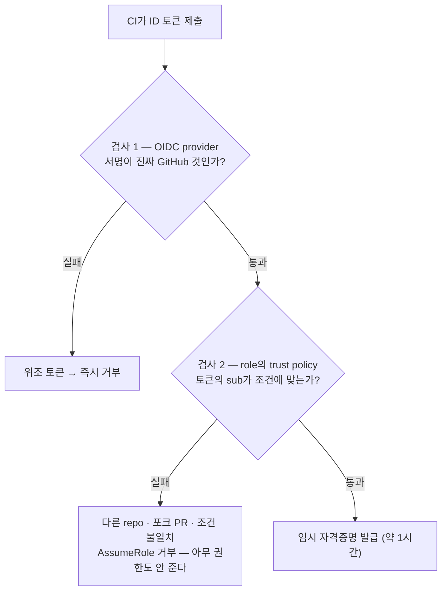
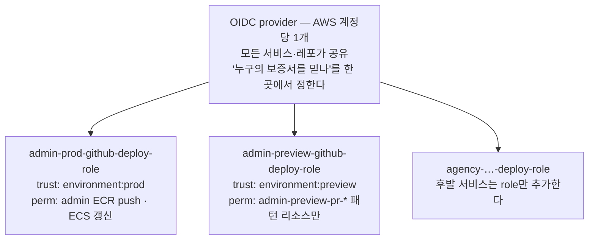

# GitHub OIDC 배포 인증

> **한 줄:** CI가 도는 곳은 GitHub 소유의 남의 서버다. 그 서버가 우리 AWS를 만지려면 신원 증명이 필요한데, **영구 비밀번호(access key)를 맡기는 대신 GitHub이 매번 써주는 서명된 보증서(ID 토큰)를 AWS가 검사하고 1시간짜리 임시 자격증명을 내주는 구조** — 이게 OIDC(OpenID Connect)다.

## 1. 문제 — 남의 서버가 우리 AWS에 docker push 해야 한다

main 머지 → GitHub Actions 워크플로가 돈다. 도는 곳은 **GitHub 소유의 우분투 서버**(우리 것이 아니다)다. 이 서버가 할 일:

- ECR(우리 이미지 저장소)에 `docker push`
- ECS 서비스에 새 배포 지시

전부 AWS 권한이 필요하다. AWS가 묻는다: "너 누군데?"

**기존 방식과 한계** — AWS 장기 access key를 GitHub Secrets에 저장하고 CI가 그 키로 접근한다.

- ⚠️ 키가 유출되면(로그 노출·포크 PR·실수 커밋) **누구나 그 키로 영구히** AWS를 만진다
- 키 교체(회전)도 수동이라 사실상 안 하게 된다

**OIDC 방식** — 장기 키가 **아예 없다.** 유출할 키가 없고, 자격증명은 약 1시간 뒤 만료된다.

## 2. 등장인물 셋

| 등장인물 | 어디 있나 | 역할 한 줄 |
|---|---|---|
| **ID 토큰** | 런타임 생성, 코드에 없음 | GitHub이 매번 써주는 서명된 보증서 |
| **OIDC provider** | 우리 AWS 계정의 IAM 리소스 | "우리 계정은 GitHub 보증서를 인정함" 등록부 |
| **배포 role** | 같은 terraform 모듈 | "그중에서도 이 조건만 통과" + 통과 시 줄 권한 |

::: warning OIDC provider는 GitHub 쪽이 아니다
이름 때문에 오해하기 쉬운데, **우리 AWS 계정에 등록하는 IAM 리소스**다. "이 발급처의 보증서를 인정한다"는 명단이 그 실체다.
:::

## 3. 실동작 5단계

### ① 워크플로가 GitHub에게 보증서를 요청

yaml의 `permissions: id-token: write`가 이 요청의 허가다. 없으면 토큰 자체를 못 만들어 다음 단계가 전부 실패한다.

### ② GitHub이 서명된 JSON 문서(= ID 토큰)를 발급

OIDC 표준 필드 4개로 된 문서다:

```json
{
  "iss": "token.actions.githubusercontent.com",              // issuer(발급자): GitHub
  "sub": "repo:my-org/my-repo:environment:prod",             // subject(주체): 이 repo의 prod 작업
  "aud": "sts.amazonaws.com",                                // audience(제출처): AWS
  "exp": 1718000000                                          // expiration(만료): 몇 분 뒤
}
```

GitHub이 자기 개인키로 서명한다 — **내용을 한 글자라도 고치면 서명이 깨진다**(위조 불가).

### ③ CI가 이 문서를 AWS에 제출

"이 보증서 들고 왔으니 배포 role 빌려줘" = `AssumeRoleWithWebIdentity` 호출.

### ④ AWS의 2단계 검사

등장인물 둘이 각각 한 검사씩 담당한다:



- **검사 1**은 GitHub 공개키로 서명을 검증한다. 단 AWS가 아무 발급자나 믿진 않는다 — **"우리 계정은 GitHub 보증서를 인정한다"고 미리 등록한 것이 OIDC provider 리소스**다(그게 이 리소스의 전부다)
- **검사 2**는 토큰의 `sub`를 role의 trust policy와 대조한다 — prod role은 `environment:prod`만, preview role은 `environment:preview`만 통과시킨다

⚠️ 검사 2 실패의 에러는 `Not authorized to perform sts:AssumeRoleWithWebIdentity` **한 줄뿐**이라 불친절하다 — **trust policy의 sub 조건 오타부터 의심할 것.**

### ⑤ 통과 → 임시 자격증명 발급 (약 1시간)

이후 `docker push`·`ecs update-service`는 전부 이 임시 키로 돈다. 1시간 뒤엔 쓰레기라 훔쳐도 곧 무효다.

## 4. 구조 — 공유 1 + 서비스별 role N



provider는 **IAM이 리전 구분 없는 계정 전역 서비스**라 하나뿐이다 — 같은 URL로 두 번째를 만들면 `EntityAlreadyExists` 에러가 난다. 그래서 뒤따르는 서비스·환경은 **data source로 참조만** 하고 새로 만들지 않는다.

**trust policy(누가 빌리나)와 permission(뭘 하나)은 별개 축이다.** 후발 서비스는 trust는 같고(같은 모노레포) permission만 자기 ECR·ECS ARN으로 다르다.

**role을 서비스별로 나누는 이유** — 합치면 admin 워크플로의 버그가 agency까지 건드릴 권한을 갖는다. 나누면 사고 반경이 서비스 1개로 제한된다. 솔직한 한계도 있다 — 같은 repo에서 다 도니 **trust 차원의 격리는 없고**, 분리의 실익은 권한 오용 방지에 있다.

**deploy role과 preview role의 trust를 합치면 안 되는 이유** — preview는 PR(아무 브랜치)에서 트리거된다. trust를 합치면 **PR이 prod 배포 권한을 갖게 된다.**

## 5. trust 방식 — ref 대신 GitHub Environments

처음엔 sub 조건을 브랜치 기준으로 걸었다: `repo:…:ref:refs/heads/main`(main에서 돈 작업만 통과).

전환 후에는 워크플로 잡에 `environment: prod`를 선언하고 trust를 `repo:…:environment:prod`로 대조한다. 얻은 것 셋:

1. 배포 이력이 repo 첫 화면 **Environments 탭**에 모인다
2. prod environment에 "배포 브랜치 main 한정"을 **GitHub 설정으로 강제** — 워크플로 yaml을 고쳐도 우회 불가
3. preview role trust가 조건 나열이 아니라 `environment:preview` 하나로 수렴한다

### 무중단 전환 패턴

trust policy의 sub 조건은 값을 **목록**으로 받고, 목록 안의 값들은 **OR**(하나만 맞아도 통과)로 평가된다.

이 목록에 **구 방식 값과 신 방식 값을 둘 다** 넣어두면, 워크플로가 어느 쪽 sub로 토큰을 받아와도 통과한다 — 워크플로 yaml 변경(머지)과 terraform apply의 **순서가 어느 쪽이 먼저여도 끊김이 없다.** 신 방식 검증이 끝나면 구 값을 제거한다.

**운영 규칙** — preview environment에는 배포 브랜치 제한을 걸면 안 된다 (PR 브랜치들이 전부 막힌다).

## 6. 몰랐던 것 → 교정된 이해

- **"yaml에 `branches: [main]`이 있는데 trust 조건이 왜 또 필요해?"** → **경계가 다른 곳에 있다.** yaml은 레포 쓰기 권한이면 누구나 수정할 수 있지만, trust policy 수정은 **AWS(terraform apply) 권한**이 필요하다. **yaml은 1차 편의 장치, trust가 진짜 방어선이다**
- **"OIDC provider를 환경마다·서비스마다 만들어야 하나?"** → 아니다. 계정당 1개이고, 나머지는 전부 data source로 발견해 쓴다
- **"AssumeRole 거부가 떴다"** → 토큰 sub와 trust 조건의 불일치가 1순위 용의자다. **에러 메시지가 원인을 안 알려준다는 것 자체를 기억할 것**

## 7. 비유

- **access key** = 사무실 **마스터 열쇠를 복사해 외주에게 줌** — 잃어버리면 자물쇠 전체 교체
- **OIDC** = 올 때마다 **1회용 출입증을 받고, 나갈 때 자동 만료** — 훔쳐도 1시간 뒤 종이쪼가리
- **OIDC provider** = 경비실의 "이 발급처 출입증은 인정함" 명단
- **trust policy** = "출입증 중에서도 소속이 ○○인 사람만" 추가 조건

## 한 줄 정리

- **OIDC = GitHub이 서명한 1회용 보증서를 AWS가 2단계(서명 → sub 조건) 검사하고 임시 자격증명을 내주는 구조.** 저장된 영구 비밀이 어디에도 없다
- 구조는 **provider 1개(계정 공유) + 서비스·환경별 role N개.** trust(누가)와 permission(뭘)은 별개 축
- trust는 ref 방식에서 **GitHub Environments 방식**으로 진화 — 배포 이력 UI + GitHub 설정 강제 + trust 간결화
- **yaml 트리거는 편의 장치, trust policy가 진짜 방어선** — 수정 권한의 경계가 다르다
