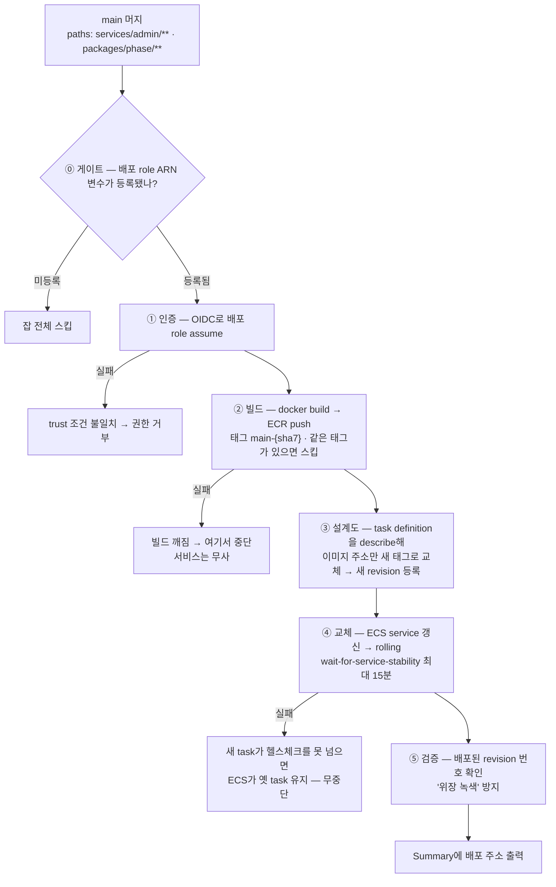
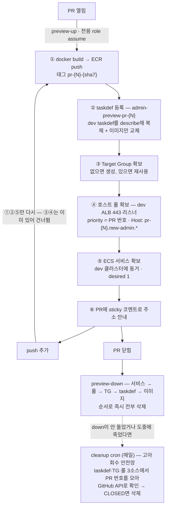

# 배포 파이프라인

> Vercel에서는 "main 머지 → 배포"가 마법처럼 일어났다. AWS에서는 그 마법의 내부 — **이미지 빌드 → 저장소 push → 실행 설계도 새 판 등록 → 점진 교체 → 안정화 확인** — 를 GitHub Actions로 전부 직접 짰다.

## 1. 전체 흐름 한 장



⓪ 게이트를 둔 이유 — 인프라 준비 전 공백기에 머지마다 가짜 빨간불이 뜨면 **"빨간불 무시 학습"**이 생긴다. 변수가 등록되는 순간 자동으로 활성화된다.

**딱 셋만 기억하면 나머지는 따라온다:**

1. **빌드(②)와 배포(③④)는 분리** — 같은 이미지를 빌드 없이 재배포할 수 있어야 롤백이 성립한다
2. **task definition은 "교체"가 아니라 "새 판 등록"** — revision이 쌓이는 불변 이력이다
3. **녹색의 정의는 "워크플로 통과"가 아니라 "의도한 revision이 실제로 떠 있음"**(⑤)

## 2. 인프라는 terraform, 이미지는 CI — 둘이 안 싸우게

task definition은 terraform이 처음 만들지만, 배포마다 CI가 새 revision을 올린다. 그대로 두면 충돌한다:

```
terraform state의 기억:  "이 서비스는 revision 5를 쓴다"
CI가 배포:               revision 7 등록 → 서비스가 7로 갱신
다음 terraform plan:     실제(7) vs 기억(5) → "7을 5로 되돌리는 변경"으로 계산
                          (현재를 코드·state에 맞추는 게 terraform의 본업이라서)
apply하면:               방금 배포한 이미지가 옛 버전으로 롤백 — 사고
```

해법은 [`lifecycle.ignore_changes`](./개념/05-terraform/02-language#_4-lifecycle-—-기본-행동-덮어쓰기)다:

```hcl
lifecycle {
  ignore_changes = [task_definition, desired_count]
}
```

terraform이 이 두 값의 변화를 비교 대상에서 뺀다(못 본 척한다).

**따라오는 운영 규칙**: `desired_count` 조정은 tfvars 수정 + apply가 아니라 `aws ecs update-service`로 한다. apply는 `ignore_changes` 때문에 무시된다 — **수시로 바뀌는 값을 state 관할 밖에 둔 의도된 설계**다.

이 구분("자주 바뀌는 건 워크플로, 뼈대는 terraform")이 나중에 preview 설계 전체로 확장된다.

## 3. SHA 태깅 — 롤백의 전제

```
빌드는 커밋마다 1회, 태그는 main-{sha7}
→ 한 커밋 = 한 이미지 = 한 태그
```

`main-` prefix를 붙이는 이유 셋:

1. preview 태그(`pr-{N}-{sha7}`)와 한눈에 구분된다
2. [ECR 자동 청소 규칙이 prefix 단위](./개념/03-컨테이너/02-ecr#_4-lifecycle-policy-—-prefix-단위-청소부)라 청소 규칙의 키가 된다
3. "main 브랜치 출처"가 이름에 박힌다

**롤백** = workflow_dispatch(수동 실행 트리거)에 옛 태그를 입력하면 **빌드 없이** 그 이미지로 재배포된다.

태그가 `latest`뿐이면 "어느 커밋인지"를 잃어 이게 불가능하다.

### 롤백 레버는 둘이고 용도가 다르다

```
이미지 롤백   workflow_dispatch + 옛 태그      "이번 배포분 코드가 문제"
환경 롤백     DNS CNAME을 옛 환경 ALB로 되돌림   "환경 전체가 문제"
```

두 번째가 가능하려면 **옛 환경 서비스를 삭제하지 않고 `desired_count 0`으로 재워둬야** 한다(깨우는 데 2~3분).

## 4. build-once — 이미지 1장으로 모든 환경

`NEXT_PUBLIC_*` 변수는 [빌드 순간 코드에 글자로 박제](./개념/03-컨테이너/04-env-secrets#_3-갈래-1-—-next-public은-빵-반죽에-넣는-재료)된다. 환경별로 값이 다르면 이미지를 환경 수만큼 구워야 한다.

실측해보니 admin의 `NEXT_PUBLIC` 2개는 dev/prod 값이 같았다 → **한 번만 빌드**한다.

이 체제의 약점은 **조용히 깨진다**는 것이다. 누가 환경별로 다른 `NEXT_PUBLIC`을 추가하는 순간 2벌 체제로 강제 회귀한다. 그래서 규약을 뒀다:

> **환경별로 갈리는 값은 `NEXT_PUBLIC` 금지, taskdef env(런타임 주입)로.**

지킴이는 빌드 스크립트 머리의 주석이다. 새 `NEXT_PUBLIC`을 추가하려면 반드시 그 파일을 열게 되므로, **규약을 어기려는 바로 그 순간에 읽히는 위치**다.

## 5. PR Preview 환경

PR마다 격리된 확인 주소(`pr-{N}.new-admin.example.com`)를 주는 **ephemeral**(일회용 — PR이 닫히면 사라지는) 환경.



**셋만 기억하면 된다:**

1. **새로 만드는 건 PR별 4종 세트**(taskdef·TG·호스트 룰·서비스)뿐 — ALB·인증서·DNS·클러스터는 dev 것을 그대로 쓴다
2. **만들고 지우는 주체는 워크플로(CLI)**, terraform은 권한과 토대만
3. **닫힘 = 즉시 전부 삭제**, cron은 삭제 담당이 아니라 실패 회수 안전망

### 왜 PR별 리소스를 terraform이 안 만드나

업계엔 두 방식이 다 표준으로 쓰인다:

| | 방식 A — CI가 terraform 실행 | **방식 B — CI가 AWS CLI 직접 호출 (선택)** |
|---|---|---|
| 동작 | PR마다 state 사본(workspace)을 만들어 apply, 닫히면 destroy | 워크플로가 4종 세트를 CLI로 생성·삭제 |
| 전제 | **CI에 state 버킷 쓰기 + apply 권한** | preview 한정 IAM role만 |

**B를 고른 결정적 이유는 권한 모델이다.** 운영 원칙이 "apply = DevOps만"인데, 방식 A는 PR CI에 apply 권한을 열어야 한다. **preview 하나를 위해 그 보안 경계를 옮기는 건 더 큰 결정**이다.

부수 이유도 있다 — PR 수만큼 state가 늘어나는 운영 복잡도(잠금 경쟁·고아 state 청소), 그리고 이미 같은 구분이 작동 중이라는 선례(§2의 `ignore_changes`).

::: warning 이 분업의 비용도 정직하게
CLI로 만든 리소스는 terraform state 밖이라 **"전체 인프라 = terraform 코드" 등식이 깨진다.** 구체적으로: terraform plan에 안 보이고, destroy로도 같이 안 지워지며, 콘솔에서 봤을 때 "이게 코드 어디 거지?"를 검색으로 못 찾는다.

보완은 둘 — 네이밍(`*-pr-{N}`)으로 "워크플로 소유물"임을 식별하고, cleanup cron이 고아를 회수한다. cron이 한 번 실패해도 괜찮다 — 매일 다시 돌고 멱등이라 다음 실행이 회수한다.

**재검토 조건**: preview 스택이 복잡해지면(PR별 DB·큐 등 10개+) CLI 스크립트가 사실상 손으로 짠 terraform이 된다. 그땐 방식 A로 전환을 검토한다.
:::

### 네이밍이 곧 시스템

| 리소스 | 이름 | 이 이름이 하는 일 |
|---|---|---|
| 이미지 태그 | `pr-{N}-{sha7}` | 청소(`pr-` prefix lifecycle)·불변성 |
| taskdef family | `admin-preview-pr-{N}` | **role 권한 경계의 패턴** |
| Target Group | `tg-admin-pr-{N}` | 32자 제한 안에서 식별 |
| 리스너 룰 priority | PR 번호 그대로 | dev 룰(100)과 충돌 회피 |
| ECS 서비스 | `admin-preview-pr-{N}` | cleanup이 "누구 것인지" 판별하는 키 |

**식별·청소·권한 경계가 전부 `pr-{N}`에 걸려 있다.**

재사용하는 토대(안 만드는 것): dev ALB와 443 리스너(입구는 하나, 구분은 Host 헤더), `*.new-admin.*` 와일드카드 인증서, 와일드카드 DNS 레코드, ALB SG(→ **preview도 회사 IP 제한을 공짜로 상속한다**), 클러스터·role·로그 그룹.

### 멱등 "확보" 구조와 dev 실물 본뜨기

**멱등**(idempotent — 몇 번 실행해도 결과가 같음) — up의 모든 단계가 "없으면 생성, 있으면 재사용/갱신"이다. push 연타·워크플로 재실행·reopen이 일상인데 **create가 두 번 돌아 에러로 죽는 워크플로는 운영이 불가능**하다.

**설정은 하드코딩하지 않고 dev 실물에서 본뜬다** — taskdef는 dev를 describe해 복제(이미지만 교체), 서비스도 dev의 네트워크·배포 설정을 읽어 복제한다. 그래야 **terraform이 dev 설정을 바꾸면 다음 preview가 자동으로 따라온다.** 하드코딩이면 dev와 preview가 조용히 어긋난다.

이 설계의 대가가 운영 규칙이 됐다: **dev 서비스는 삭제 금지.** `desired 0`으로 재워도 describe는 정상이지만, 지우면 **preview의 설계도 원본이 사라져** 생성이 깨진다.

### 생명주기 — 즉시 삭제 + cron 안전망

보존 정책은 한 번 뒤집었다. 원래 "close 후 7일 보존"이었는데 **close 즉시 전부 삭제**로 바꿨다. 보존 창의 실효가 없었기 때문이다 — 머지분은 dev 주소가 바로 보여주고, 닫힌 PR 재확인은 reopen하면 up의 확보 로직이 수 분 내 새로 만든다([214MB 이미지 + 1초 미만 기동](./개념/03-컨테이너/03-dockerfile#_1-문제-—-빌드-도구까지-통째로-배달할-셈인가)이라 가능하다). 죽은 리소스가 콘솔과 ALB 룰 한도를 점유할 이유가 없다.

**cron은 삭제 담당이 아니라 안전망이다.** 설계 당일에 실증됐다 — GitHub close 이벤트(webhook) 유실이 실제로 1회 발생해 down이 안 돌았고, cleanup이 설계대로 다음 실행에서 회수했다.

따라온 운영 규칙: **외부 이벤트 대기는 정상 기준선을 먼저 명시하고, 몇 배 초과 시 "지연"이 아니라 "유실"로 간주해 대안 경로로 전환한다.**

### 보안 — 전용 role과 정직한 한계

기존 deploy role의 trust를 넓히는 대신 **role을 새로 팠다.** 합치면 PR 하나가 실수로 dev 서비스를 통째로 교체할 권한을 갖는다 — 사고 반경이 "preview 1개"에서 "dev 전체"로 커진다.

| | deploy role | **preview role** |
|---|---|---|
| trust | `environment:prod` | `environment:preview` + main ref (cron이 main 컨텍스트로 돌아서) |
| ECS | prod 서비스 갱신만 | `admin-preview-pr-*` 생성/갱신/삭제만 |
| 못 하는 것 | preview 생성 | **dev·prod 서비스 변경** |

권한 작성에서 배운 함정 둘:

**① 읽기 권한도 statement를 분리할 것.** preview-up이 dev 서비스를 describe(본뜨기)해야 해서 dev 읽기가 필요한데, 이를 preview 쓰기 권한과 **한 statement에 합치면 dev 변경 권한이 누수된다.** 쓰기와 읽기를 별도 statement로 나눠야 한다.

**② IAM이 리소스 한정을 지원하지 않는 액션이 있다.** IAM 액션마다 "리소스를 좁혀 적을 수 있는지"가 AWS 공식 문서(Service Authorization Reference)에 정해져 있는데, `ecs:DeregisterTaskDefinition` 같은 액션은 **좁히기 자체가 미지원**이다.

이런 액션을 패턴 한정으로 적으면 패턴이 틀린 게 아니라 **패턴이라는 표현 자체가 성립하지 않아 영구 거부**된다. 게다가 에러가 `on resource: *`로 평가됐다고만 떠서 **패턴 오타를 의심하며 헤매게 된다.**

해법은 해당 액션만 `Resource = "*"` statement로 분리하는 것이다 — taskdef 등록·해제 자체는 무해하고, 그걸 **서비스에 연결하는** 권한이 패턴으로 잠겨 있어 경계는 유지된다.

**비용 감각**: preview 1개 = task 1개(0.5vCPU·1GB) = 시간당 약 $0.028. PR을 3일 열어두면 약 $2고, 닫히면 0이다. 비용 다이얼은 **동시에 떠 있는 task 수**뿐이다.

## 6. 몰랐던 것 → 교정된 이해

### 워크플로 녹색 ≠ 배포 성공

**circuit breaker**는 ECS의 배포 자동 롤백 장치다. 새 revision의 task가 헬스체크를 못 넘겨 죽고 다시 뜨기를 반복하면(기동 3회 실패 기준), ECS가 그 배포를 실패로 판정하고 **직전 revision으로 자동 복귀**한다.

무한 교체 사고를 막는 좋은 장치인데 부작용이 있다:

```
복귀가 끝나면 서비스가 "안정" 상태
→ 워크플로의 안정화 대기는 통과
→ 서비스는 옛 버전인데 워크플로만 녹색 = "위장 녹색"
```

그래서 **배포 후 revision 번호를 검증하는 단계**를 따로 넣었다.

### paths 트리거의 사각지대

`paths` 필터는 "커밋에서 바뀐 파일의 경로 목록"과 glob 패턴을 **글자로 대조할 뿐**, 그 파일이 **빌드 결과물에 영향을 주는지는 모른다.**

루트의 `.npmrc`·lockfile은 Docker 빌드에 들어가는 파일인데 `services/admin/**` 패턴 밖이라, 바뀌어도 배포가 안 태워진다. 그래서 의존하는 workspace 패키지 경로를 패턴에 포함했고, **빠진 경로를 발견할 때마다 paths에 추가하는 게 운영 방식**이 됐다.

### 코드 완성 ≠ 끝, 실증이 끝

이 파이프라인의 트러블 전부가 코드 리뷰가 아니라 **첫 실전 머지에서** 나왔다. 로컬 docker로 못 잡는 부류(ECS만 주입하는 `HOSTNAME`)와 terraform plan으로 못 잡는 부류(보안그룹 quota)가 따로 있다.

**"어디까지 돌려봤나"가 완료의 정의다.**

## 7. 비유

- **task definition revision** = 요리 레시피의 **판본** — 고치는 게 아니라 새 판을 찍고, 주방(service)에 "이제 7판으로 만들어"라고 지시한다
- **rolling 배포** = 식당 영업 중 주방장 교대 — 새 주방장이 첫 요리(헬스체크)를 통과해야 옛 주방장이 퇴근한다
- **불변 태그** = 판본에 박힌 ISBN — 같은 번호면 내용이 같다고 믿을 수 있어야 롤백이 성립한다

## 한 줄 정리

- 파이프라인 = **게이트 → OIDC 인증 → 빌드(`main-{sha7}`) → revision 등록 → rolling → revision 검증.** 각 단계의 실패가 서비스를 깨뜨리지 않게 설계했다
- **terraform과 CI의 경계** = `ignore_changes` — 인프라 골격은 terraform, 이미지·task 수는 CI/CLI
- **롤백 레버 둘**: 이미지(옛 태그 재배포) / 환경 전체(DNS를 재워둔 옛 환경으로)
- **preview는 분업이 설계의 전부** — PR별 4종 세트는 워크플로(CLI)가, 권한·토대는 terraform이. 근거는 "apply는 DevOps만" 권한 모델
- **네이밍 `pr-{N}`이 식별·청소·권한 경계를 전부 짊어진다**
- **녹색의 정의는 "의도한 revision이 떠 있음"까지.** 실증까지가 작업이다
