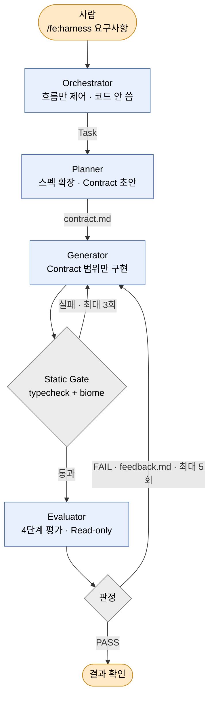
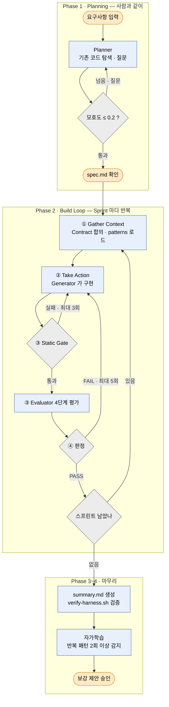

# FE 에이전틱 하네스 v1

> 이후 [v2](./fe-harness-v2.draft) 로 다시 만들었다. 지금 운영하는 건 v2 다.

## 읽기 전에 — 관련 개념

| 여기서 다루는 것 | 개념 |
| --- | --- |
| Generator·Evaluator 를 나눈 이유 | [Self-Preference Bias](./개념/에이전틱과-하네스.draft#에이전틱의-구조적-한계-—-self-preference-bias-자기선호편향) · [역할 분리](./개념/에이전틱과-하네스.draft#_1-역할-분리-role-separation) |
| Evaluator 에서 Write/Edit 를 뺀 이유 | [도구 제한](./개념/에이전틱과-하네스.draft#_4-도구-제한-tool-restriction) |
| Sprint 가 도는 모양 | [에이전트 루프](./개념/에이전틱과-하네스.draft#에이전트-루프-—-하네스의-심장) |
| 규칙이 쌓이는 구조 | [규칙 축적](./개념/에이전틱과-하네스.draft#_3-규칙-축적-rule-accumulation) |
| 패턴을 선택적으로 로드하는 이유 | [4대 설계 원칙](./개념/에이전틱과-하네스.draft#_4대-설계-원칙) |

---

## fe-harness란

> **[에이전틱과 하네스](./개념/에이전틱과-하네스.draft)를 FE 코드 품질 자동화에 적용한 Claude Code 플러그인 (`fe-workflow`). 실제 업무 프로젝트에 적용 중.**
>  Sprint를 돌릴 때마다 발견한 문제가 규칙으로 쌓이며 점점 단단해지는 구조.

---

## 한눈에 보는 아키텍처

주황 둥근 상자 = 사람. 파랑 상자 = AI 에이전트. 회색 마름모 = 스크립트가 정하는 분기.
화살표 글자 = 그리로 가는 조건. 글자 없으면 무조건 다음.




Orchestrator 는 **직접 코드를 쓰지 않는다.** `/fe:harness` SKILL.md 지시를 따라 Task 로 sub-agent 를 호출하고 흐름만 제어한다.

| 역할 | 하는 일 | 막아둔 도구 |
| --- | --- | --- |
| Planner | 스펙 확장 · Contract 초안 | Bash |
| Generator | Contract 범위의 코드 구현 | Bash |
| Evaluator | 4단계 평가 (Read-only) | Write · Edit · Bash |
| Static Gate | typecheck + biome — 결정론적이라 AI 가 아니다 | — |

셋은 **파일로만 소통한다** — `spec.md` · `contract.md` · `feedback.md` · `eval-log.md`.

초기 로드:

- `rules/` 4개 (code-principles, folder-structure, api-layer, coding-style) — 항상 적용
- `patterns/` 7개 (common 은 항상, api·form·table·filter·file·libraries 는 Sprint 별 선택 로드)

산출물은 `.ai/harness/{도메인}/{페이지}/` 아래 `spec.md` · `contract.md` · `eval-log-r*.md` · `feedback-r*.md` · `summary.md`.


Orchestrator 는 **직접 코드를 쓰지 않는다.** `/fe:harness` SKILL.md 지시를 따라 Task 로 sub-agent 를 호출하고 흐름만 제어한다.

| 역할 | 하는 일 | 막아둔 도구 |
| --- | --- | --- |
| Planner | 스펙 확장 · Contract 초안 | Bash |
| Generator | Contract 범위의 코드 구현 | Bash |
| Evaluator | 4단계 평가 (Read-only) | Write · Edit · Bash |
| Static Gate | typecheck + biome — 결정론적 검증 | — |

셋은 **파일로만 소통한다** — `spec.md` · `contract.md` · `feedback.md` · `eval-log.md`.

초기 로드:

- `rules/` 4개 (code-principles, folder-structure, api-layer, coding-style) — 항상 적용
- `patterns/` 7개 (common 은 항상, api·form·table·filter·file·libraries 는 Sprint 별 선택 로드)

산출물은 `.ai/harness/{도메인}/{페이지}/` 아래 `spec.md` · `contract.md` · `eval-log-r*.md` · `feedback-r*.md` · `summary.md`.


셋은 **파일로만 소통한다** — `spec.md` · `contract.md` · `feedback.md` · `eval-log.md`.

초기 로드:

- `rules/` 4개 (code-principles, folder-structure, api-layer, coding-style) — 항상 적용
- `patterns/` 7개 (common은 항상, api·form·table·filter·file·libraries는 Sprint별 선택 로드)

산출물은 `.ai/harness/{도메인}/{페이지}/` 아래 `spec.md` · `contract.md` · `eval-log-r*.md` · `feedback-r*.md` · `summary.md`.


---

## 플러그인 구성

```
fe-workflow/
├── skills/          ← 사용자가 호출하는 명령 6개
├── agents/          ← sub-agent 3명 (planner/generator/evaluator)
├── rules/           ← 보편적 규칙 4개 (항상 로드)
├── patterns/        ← 도메인별 패턴 7개 (선택적 로드)
├── harness/         ← 설정 + 템플릿 (config, spec/contract/summary)
└── scripts/         ← verify-harness.sh (산출물 구조 자동 검증)
```

**Skills (사용자 명령):**


| 명령                 | 역할                                                       |
| ------------------ | -------------------------------------------------------- |
| `/fe:harness`      | **전체 파이프라인 실행** (Planning → Build Loop → Summary → 자가학습) |
| `/fe:reflect`      | 하네스 완료 후 **수동** 자가학습                                     |
| `fe-principles`    | 직접 코딩 시 rules/patterns 안내                                |


---

## 4가지 역할 — Orchestrator + 3 Sub-agent

모두 **Claude Opus** 모델을 사용하고, 각자 다른 도구 제한이 걸려 있다.


| 역할               | 정체                      | 하는 일                                           | `disallowedTools`                                 |
| ---------------- | ----------------------- | ---------------------------------------------- | ------------------------------------------------- |
| **Orchestrator** | **메인 세션** (별도 agent 아님) | 흐름 제어. 각 Phase 순서대로 sub-agent 호출. 직접 코드 작성 안 함 | — (Skill 프롬프트에 "직접 작성 금지" 규칙)                     |
| **Planner**      | sub-agent               | 요구사항 → 스펙 → Sprint 분해 + Contract 초안            | `Bash, NotebookEdit` — 명령 실행 차단                   |
| **Generator**    | sub-agent               | Contract 범위의 코드 구현                             | `Bash, NotebookEdit` — 명령 실행 차단. 자기 평가도 하지 않음     |
| **Evaluator**    | sub-agent               | 4단계 코드 평가                                      | `Write, Edit, Bash, NotebookEdit` — **Read-only** |


**Orchestrator는 Claude Code 메인 세션이 `/fe:harness` 스킬 프롬프트를 받아 수행하는 역할이다.** 별도 AI 에이전트가 아니다. 스킬 맨 첫 줄: *"너는 FE 하네스의 통합 Orchestrator다. 직접 코드를 작성하지 않는다. Agent에게 위임하고 흐름을 제어한다."* → 메인 세션이 이 지시대로 동작하며, Task 도구로 Planner/Generator/Evaluator sub-agent를 스폰한다.

**Evaluator의 `Write/Edit` 제거가 핵심:** 수정 도구가 있으면 "내가 고쳐줄게"로 리뷰가 흐트러짐. 도구를 빼서 **구조적으로** 평가에만 집중시킴. ([도구 제한](./개념/에이전틱과-하네스.draft#_4-도구-제한-tool-restriction))

**에이전트는 파일로만 소통:**

- Planner가 쓴 `spec.md`를 Generator/Evaluator가 읽음
- Planner가 초안 쓴 `contract.md`를 Evaluator가 검토 후 확정
- Generator 코드를 Evaluator가 읽고 `eval-log.md` 작성
- FAIL 시 `feedback.md`를 Generator가 받아 수정

대화가 아닌 문서 기반이라 reasoning이 섞이지 않음.

---

## Rules vs Patterns — 항상 로드 vs 선택적 로드

컨벤션을 두 층으로 나눴다.

**Rules (항상 로드, 4개):** 모든 Sprint가 공통으로 따르는 보편 규칙.


| 파일                    | 내용                                 |
| --------------------- | ---------------------------------- |
| `code-principles.md`  | SRP, SSOT, 추상화, 네이밍, 인지부하          |
| `folder-structure.md` | Page First, 지역성, 폴더 분리 원칙          |
| `api-layer.md`        | API 호출 원칙, fetch* 접두사, 타입 정의       |
| `coding-style.md`     | useEffect, Boolean Props, 타입 단언 금지 |


**Patterns (7개):** 특정 Sprint 범위에서만 필요한 도메인 패턴. `common.md`만 항상 로드, 나머지는 선택적 로드.


| 파일             | 내용                                   | 선택 기준              |
| -------------- | ------------------------------------ | ------------------ |
| `common.md`    | Sprint 무관 보편 구현 패턴                   | **항상 로드**          |
| `api.md`       | API 계층 구현 템플릿 (fetch/query/mutation) | API 계층 Sprint      |
| `form.md`      | react-hook-form + Zod + TDS 컴포넌트 연동  | 폼 Sprint           |
| `table.md`     | 테이블 (정렬, 무한 스크롤, 체크박스, 빈 상태)         | 테이블 Sprint         |
| `filter.md`    | URL 동기화 필터 (nuqs 기반)                 | 필터 Sprint          |
| `file.md`      | 파일 선택/검증/업로드/표시                      | 파일 업로드 Sprint      |
| `libraries.md` | @tossteam/is, overlay-kit 등 Toss 패키지 | 해당 라이브러리 사용 Sprint |


**선택적 로드 방식:**

1. Planner가 Sprint 범위 보고 필요 패턴 판단
2. Contract의 "필요 패턴" 섹션에 명시
3. Generator/Evaluator가 명시된 패턴만 로드 (컨텍스트 격리 — [4대 설계 원칙](./개념/에이전틱과-하네스.draft#_4대-설계-원칙))

---

## 전체 흐름: 4 Phase




**Phase 2 의 ①~④ 가 [에이전트 루프](./개념/에이전틱과-하네스.draft#에이전트-루프-—-하네스의-심장)다.** Sprint 마다 이 네 칸을 돈다.

- **① Gather Context** — Contract 합의(Planner 초안 → Evaluator 검토), 명시된 patterns 인라인 로드
- **② Take Action** — Generator 가 Contract 범위의 코드만 구현. 범위 밖 금지
- **③ Verify Work** — Static Gate 통과 후 Evaluator 4단계 평가
- **④ Repeat** — PASS 면 다음 Sprint, FAIL 이면 `feedback.md` 를 남기고 재구현

Phase 4 자가학습은 이번 `eval-log` 와 이전 실행을 비교해 반복 패턴(2회 이상)을 찾고, `rules`·`patterns` 보강을 제안한다 — 반영은 사람 승인 뒤에.


**Phase 1 — Planning** (사람 + AI 협업)

- `rules` 4개 + `patterns` 목록 초기 로드
- Planner 가 기존 코드 탐색
- 소크라테스식 질문으로 스펙 확장, 모호성 자체 점검(≤ 0.2 통과)
- `spec.md` 생성 → 사람 확인

**Phase 2 — Build Loop** (AI 자율, Sprint 순차). 위 ①~④ 가 Sprint 마다 도는 [에이전트 루프](./개념/에이전틱과-하네스.draft#에이전트-루프-—-하네스의-심장)다.

- **① Gather Context** — Contract 합의(Planner 초안 → Evaluator 검토), 명시된 patterns 인라인 로드
- **② Take Action** — Generator 가 Contract 범위의 코드만 구현. 범위 밖 금지
- **③ Verify Work** — Static Gate(typecheck + biome) 통과 후 Evaluator 4단계 평가
- **④ Repeat** — PASS 면 다음 Sprint, FAIL 이면 `feedback.md` 를 남기고 재구현

**Phase 3 — Summary** — `summary.md` 자동 생성 · `verify-harness.sh` 로 산출물 검증 · 사람에게 전달

**Phase 4 — 자가학습** (자동) — 이번 `eval-log` 와 이전 실행 비교 → 반복 패턴(2회 이상) 감지 → `rules`·`patterns` 보강 제안 → 사람 승인 → 반영


---

## 산출물 구조

`.ai/harness/{도메인}/{페이지}/` 하위에 전부 자동 저장된다.

```
.ai/harness/은행-제신고/정보입력퍼널/
├── spec.md                    ← Planner 작성
├── domain-context.md          ← 도메인 간 공유 자원 기록
├── external-context.md        ← 외부 URL 내용 (있으면)
├── sprint-1/
│   ├── contract.md            ← Planner 초안 → Evaluator 검토 확정
│   ├── eval-log-r1.md         ← Round 1 평가 (FAIL)
│   ├── feedback-r1.md         ← FAIL 시 피드백
│   └── eval-log-r2.md         ← Round 2 평가 (PASS)
├── sprint-2/...
├── ...
└── summary.md                 ← Phase 3 종합 보고
```

**domain-context.md**는 같은 도메인의 여러 페이지를 만들 때 공유 자원(DTO, remote, query)을 추적하는 파일. "이 도메인에서 이미 만든 것"을 기록해 다음 페이지에서 재사용 판단에 쓴다.

---

## Evaluator 4단계 평가


| 단계                 | 성격          | 하는 일                                             |
| ------------------ | ----------- | ------------------------------------------------ |
| **A. Contract 기준** | 닫힌 평가       | 합의 항목을 하나씩 pass/fail. **1개라도 fail이면 Sprint 미통과** |
| **B. 열린 평가**       | 자유 판단       | Contract 밖 품질 이슈 (컨벤션 준수, 불필요한 복잡도, UX 기본)       |
| **C. Contrarian**  | Red Teaming | "가장 약한 점?" "6개월 후 문제?" 강제 의심. **최소 1개 약점 필수**    |
| **D. Contract 검토** | 메타 평가       | 코드가 아닌 **Contract 자체**가 부실한지 점검 (Ouroboros 영감)   |


**점수 공식 (harness-config.md에 설정):**

```
품질 점수 = Contract 통과율 × 0.6
         + 열린 평가      × 0.3
         + Contrarian    × 0.1
         × 10

통과 조건 = Contract 전부 pass AND 품질 점수 ≥ 8.0
```

**심각도 점수:**

- 열린 평가: 없음=1.0, 경미=0.85, 중간=0.7, 심각=0.5
- Contrarian: 없음=1.0, 경미=0.8, 중간=0.6

C단계(Contrarian)는 AI Red Teaming. 군사 Blue Team 작전에 Red Team이 허점을 공격하는 것과 같다. A, B에서 "괜찮다"고 넘어간 것도 강제로 의심한다.

---

## 수렴 감지 — 언제 멈추는가

무한 루프를 막기 위한 종료 조건. **판정은 Round 단위로 일어난다** — 각 Round의 Evaluator 결과를 보고 다음 행동(RETRY / PIVOT / HALT)을 결정. `harness-config.md`에 하드코딩된 임계값을 기반으로 Orchestrator가 자동 판정한다.

**핵심 정책: PASS(품질 점수 ≥ 8.0) 아니면 자동 수용하지 않는다.**

기술적으로는 Ouroboros처럼 "수렴하면 자동 수용" 경로를 넣을 수 있지만, **품질을 중시해서 사람 개입 경로를 의도적으로 남겼다.** fe-harness는 실제 배포될 프로덕션 코드를 생성하기 때문에, **Round 점수가 통과 기준(8.0)을 못 넘은 상태로 Sprint를 완료시키고 다음 Sprint로 넘어가면** 누적 품질 문제가 커진다. "빠른 자동화"보다 "사람이 한 번 더 확인"을 선택한 설계.

`**harness-config.md`에 하드코딩된 임계값:**


| 항목                 | 값       | 의미                                               |
| ------------------ | ------- | ------------------------------------------------ |
| Static Gate 최대 재시도 | **3**   | typecheck/biome 실패 시 Generator 재시도 상한 (Round 내부) |
| Eval Loop 최대 Round | **5**   | 한 Sprint 내에서 Round가 이 이상 가면 HALT                 |
| PASS 임계값           | **8.0** | 한 Round의 품질 점수가 이 이상이면 통과 (자동 수용 유일한 경로)         |
| 개선폭 임계값 (delta)    | **0.3** | 직전 Round 대비 점수 차가 이 이상이면 개선 중으로 판단               |
| 정체 연속 허용 횟수        | **2**   | Round 2회 연속 정체면 HALT (사람 개입)                     |
| 방향 전환 임계값          | **5.0** | Round 점수가 이 미만이면 접근 자체가 잘못된 것으로 판단               |


**delta는 "직전 Round 대비 점수 변화량"이다.** (Round는 같은 Sprint 내 반복 시도 단위)

```
delta = current_score - previous_score
```


| Round | 점수  | delta | 해석                   |
| ----- | --- | ----- | -------------------- |
| R1    | 7.0 | —     | 기준점 없음 (첫 시도는 RETRY) |
| R2    | 7.5 | +0.5  | 개선 중 → RETRY         |
| R3    | 7.6 | +0.1  | 정체 (0.3 미만)          |
| R4    | 7.2 | -0.4  | 악화 (음수도 정체 취급)       |


`**delta ≥ 0.3`의 의미:** 직전 Round보다 0.3점 이상 올라야 "나아지고 있다"고 본다. 0.1~0.2점 오르면 정체로 간주 (미미한 개선은 의미 없음). 악화(음수)도 정체.

**판정 알고리즘 — 각 Round 끝에서 실행 (위에서부터 첫 매칭):**

```
변수 (현재 Round 기준):
  current_score    = 이번 Round 점수
  previous_score   = 직전 Round 점수 (R1이면 없음)
  delta            = current_score - previous_score
  stagnation_count = 같은 Sprint 내 Round 간 정체 누적 카운트
  round            = 현재 Round 번호 (R1, R2, ...)

판정:
  1. current_score < 5.0        → PIVOT    (방향 전환, 사람 알림)
  2. round >= 5                 → HALT     (안전장치, 강제 중단)
  3. R1 (previous 없음)          → RETRY    (기준점 없음, 다음 Round로)
  4. delta >= 0.3               → RETRY    (개선 중, stagnation 리셋)
  5. delta < 0.3                → 정체:
       stagnation_count += 1
       if stagnation_count >= 2 → HALT     (Round 2회 연속 정체, 사람 개입)
       else                     → RETRY    (다음 Round에서 한 번 더 기회)
```

**각 결과별 동작:**


| 판정        | 뜻                   | 언제 발동                            | 동작                                                    |
| --------- | ------------------- | -------------------------------- | ----------------------------------------------------- |
| **RETRY** | 재시도 (같은 방향으로 한 번 더) | FAIL이지만 개선 중 or 첫 Round          | feedback.md 생성 → Generator 재구현 → 다시 Verify (다음 Round) |
| **PIVOT** | 방향 전환 (접근 자체를 바꾼다)  | Round 점수 < 5.0                   | 접근이 근본적으로 잘못됨. 사람이 스펙/Contract 재설계                    |
| **HALT**  | 중단 (멈춰라, 사람 판단 필요)  | Round 2회 연속 정체 or 최대 Round(5) 도달 | 강제 중단 후 사람이 결과 보고 판단 (유지/재시도/방향 전환 결정)                |


**Round 점수 구간별 동작:**


| Round 점수  | 동작                                          |
| --------- | ------------------------------------------- |
| ≥ 8.0     | PASS (Sprint 완료, 다음 Sprint로)                |
| 5.0 ~ 8.0 | Round 간 정체 시 HALT / 개선 중이면 RETRY (다음 Round) |
| < 5.0     | 즉시 PIVOT (방향 자체가 틀림)                        |


> **주의: PIVOT / HALT는 "자동 수용 후 진행"이 아니다.** 둘 다 "사람에게 판단을 넘기고 Sprint 중단"이다. PASS(≥ 8.0) 아니면 다음 Sprint로 자동 진행되지 않는다. 사람이 결과를 보고 "이대로 두기" or "다시 시도" or "방향 전환"을 결정한다.

**실사용 빈도:** PIVOT / HALT는 **안전장치**로 존재할 뿐 실제 실행에서는 거의 발동 안 함. 보통 Sprint는 R1 또는 R2에서 PASS로 끝난다 — 은행 제신고 케이스도 5 Sprint 전부 사람 개입 없이 완료됨 (R1 FAIL → R2 PASS는 자동 RETRY 경로).

**Ouroboros와의 연결점:** Ouroboros는 `Similarity ≥ 0.95`, `Ambiguity ≤ 0.2` 같은 수치 게이트로 자기참조 루프를 닫는다. fe-harness도 모호성 점수 ≤ 0.2(Planner 게이트) + delta 0.3 / 점수 5.0 / PASS 8.0(Eval 게이트)로 같은 철학을 적용했다.

---

## 실제 실행 결과 — 은행 제신고 정보 입력 퍼널

`/fe:harness "은행 제신고 정보 입력 퍼널 구현"` 실행. 5 Sprint, 평균 9.2/10.


| Sprint | 범위                          | 점수  | 판정   | 라운드                          |
| ------ | --------------------------- | --- | ---- | ---------------------------- |
| 1      | 퍼널 뼈대 + 공통 + Intro          | 9.3 | PASS | **R2** (R1 FAIL → 수정 후 PASS) |
| 2      | SelectType + 동의 BottomSheet | 9.4 | PASS | R1                           |
| 3      | Representative (대표자 정보)     | 9.2 | PASS | R1                           |
| 4      | Business + 주소 검색            | 9.0 | PASS | R1                           |
| 5      | CoRepresentative (공동대표)     | 9.2 | PASS | R1                           |


**총 생성 파일 22개** — 퍼널 컴포넌트, 입력 스텝(이름/이메일/휴대폰/사업자번호 등), 주소 검색 오버레이, Context/Hook 등.

**Sprint 1이 흥미롭다 — R1 FAIL → R2 PASS:**

```
Round 1: FAIL
  Evaluator 지적: "TDS v1 API를 v3 스타일로 호출 중"
    · AssetIcon → Asset.Icon
    · TextFieldClearable → TextField.Clearable
    · TopTitleParagraph → Top.TitleParagraph
    · ... 등 19건
  feedback-r1.md 생성

Round 2: Generator가 feedback-r1.md만 보고 수정
  (이전 자기 reasoning 못 봄 — 컨텍스트 격리)
  → 19개 API 매핑 전부 수정
  → Eval 9.3/10 PASS
```

이 학습은 `summary.md`에 **"TDS v1 API 매핑 학습 포인트"** 섹션으로 자동 기록됨. Phase 4 자가학습에서 반복 패턴으로 감지되면 `rules/` 또는 `patterns/`에 새 규칙으로 제안된다 — [규칙 축적](./개념/에이전틱과-하네스.draft#_3-규칙-축적-rule-accumulation)이 실제로 작동한 사례.

---

## 자가학습 두 갈래

fe-harness는 **두 가지 경로로** 규칙을 축적한다.

### 경로 1: Phase 4 자동 자가학습 (eval-log 기반)

하네스 완료 후 자동 실행:

```
이번 실행의 eval-log 수집
  ↓
이전 실행들의 eval-log와 비교
  ↓
같은/유사한 피드백이 2회 이상 등장?
  ↓ YES
rules/ 또는 patterns/ 어디에 추가할지 판단
  ↓
AskUserQuestion: "이 규칙을 patterns/form.md에 추가할까요? [승인/수정/거부]"
  ↓
승인 → Edit으로 파일 반영
```

**제외 조건:**

- 1회만 등장한 피드백 (다음에 또 나오면 그때)
- 이미 rules/patterns에 있는 규칙의 위반 (Generator가 안 따른 것)
- Contract 특화 피드백 (범용화 불가)

### 경로 2: `/fe:reflect` 수동 자가학습 (사용자 수정 기반)

하네스 완료 후 사람이 직접 수정한 경우를 분석. 개발자가 AI와 티키타카하며 고친 내용을 규칙화한다.

```
/fe:reflect 호출
  ↓
git log에서 (harness) 스코프 커밋 식별
  ↓
이후 수정 커밋들의 diff + 세션 transcript 수집
  ↓
transcript + diff 함께 분석 → "사용자가 뭘 왜 고쳤나" 추출
  ↓
기존 rules/patterns와 대조 → 갭 발견
  ↓
새 규칙 제안 → 승인 → 반영
```

**두 경로의 차이:**

- Phase 4 = **Generator가 만든 코드의 반복 문제** (eval-log 기반)
- `/fe:reflect` = **사용자가 수정한 내용** (transcript + git diff 기반)

둘을 합쳐 **"실수가 규칙으로 전환되는 자가진화"**가 완성된다 ([규칙 축적](./개념/에이전틱과-하네스.draft#_3-규칙-축적-rule-accumulation)).

---

## 핵심 메시지

> AI한테 "잘해줘"라고 부탁하는 대신,
> **잘못할 수 없는 환경을 만드는 것.** 그게 하네스다.

> 그리고 그 환경 안에서
> **AI가 자율적으로 협업하며 반복해서 일하게 하는 것.** 그게 에이전틱이다.

> **새로 배울 것 없음.** 이미 알고 있는 원칙을 AI 시대에 더 의식적으로 적용하는 것.


| 이미 알고 있는 것       | 하네스에서의 적용                 |
| ---------------- | ------------------------- |
| 역할 분리            | 에이전트별 도구 제한               |
| 기준 합의            | Sprint Contract           |
| 코드 리뷰            | Evaluator 4단계             |
| 피드백 반영           | feedback.md → 재생성         |
| CI/CD            | Static Gate (tsc + biome) |
| Post-Mortem → 규칙 | Self-Improving Loop       |


---
