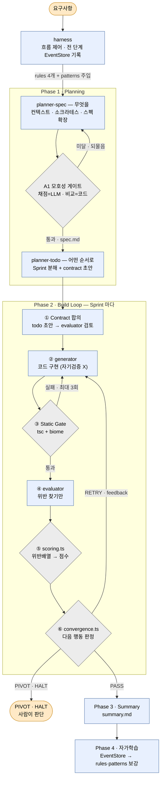

# FE 에이전틱 하네스 v2

> 2026-06-06 발표 자료 중 fe-plugin 부분. **이 문서만으로 완결되게** 썼으므로
> [v1](./fe-harness.draft) 을 안 읽어도 된다. v1 에서 뭐가 달라졌는지는 아래 표가 답한다.

## 도입 — 나는 왜 이걸 만들었나

개발을 하면서 비슷한 작업이 계속 반복돼요. 컴포넌트 만들고, API 붙이고, 폼 짜고, 폴더 구조 잡고… 패턴은 거의 같은데 매번 비슷한 작업을 합니다.

그래서 생각했죠. **"이 반복 작업을 AI에게 넘겨서 자동화 할 수 없을까?"**

저는 이를 재테크와 같은 거라고 생각했습니다. 돈이 돈을 굴리듯, **내가 자는 동안에도 AI가 내 반복 작업을 굴리게** 하는 것. 나를 대체하는 게 아니라, 제가 일하지 않을 때에도 일하게 만드는 거죠. (잠 잘때나 휴식 등)

그 도구가 **fe-plugin(fe-harness)** 입니다. 부품이 되는 Skill·Agent·Hook 은 [Skill · Agent · Hook](../claude-code/개념/plugin-components.draft) 가 다룹니다.

만들면서 하나를 알게 됐습니다. **AI는 판단은 해도 산수는 못 합니다.** 같은 코드를 두 번 채점하면 점수가 다르게 나와요. 이 문장이 v2 전체를 가르는 선이 됩니다.

---

## v2 는 왜 나왔나

v1은 잘 돕니다. 그런데 한 가지 걸리는 게 있어요. **점수 계산을 evaluator(LLM)가 직접 합니다.** "Contract 0.6 + B 0.3 + C 0.1 × 10 = 9.2" 같은 산수를 AI가 하죠. 그런데 도입에서 말했듯 — **AI는 판단은 해도 산수는 가끔 틀립니다.**

→ "위반을 찾는 **판단**은 AI가, 점수 **계산**은 코드가" 나누면 더 안정적이지 않을까? 이게 **v2의 출발점**입니다.

---

> v2는 지금 운영 중인 구조(0.77)입니다. 아래 표로 빠르게 개요를 보고, 그다음 **이 버전만으로 완결되게** 전체를 설명합니다.

## 무엇이 달라졌나 (한눈에)

| 변화           | v1                 | v2                                          |
| ------------ | ------------------ | ------------------------------------------- |
| ① 점수 계산      | evaluator(LLM)가 산수 | evaluator는 **위반만 찾고**, 코드(`scoring.ts`)가 계산 |
| ② 수렴 판정      | LLM이 delta 보고 판단   | 코드(`convergence.ts`)가 판정                    |
| ③ planner    | 1개 (스펙+분해 다)       | **2개로 분리** (spec="무엇" / todo="순서")          |
| ④ reviewer   | 없음                 | **추가** (별도 `/fe:review`)                    |
| ⑤ 평가 점수      | 가장 심각한 1개만         | **위반마다 누적 감점** (v1 약점 해결)                   |
| ＋ EventStore | 없음                 | **전 과정을 DB에 기록 → 자가학습 데이터**                 |

핵심 한 줄: **"판단은 AI가, 계산은 코드가."** — 도입에서 *"AI는 산수를 못 한다"*고 한 그 복선의 답입니다.

## 1. 무엇을 자동화하나

요구사항 하나로 **스펙 → 구현 → 평가 → 학습**까지 자동으로 굴러갑니다. "주문 목록 페이지 만들어줘" 한 마디면, 스펙 작성부터 구현·검증까지 알아서 진행돼요.

## 2. 전체 구조 — 에이전트 5개 + 지휘자 1 + 계산 코드

| 구성 | 역할 |
| --- | --- |
| **harness** (Skill) | 지휘자(Orchestrator). 코드 안 짜고 흐름 제어 + **모든 단계를 EventStore에 기록** |
| **planner-spec** (Agent) | "무엇을" — 스펙 확정 + 모호성 게이트(A1) |
| **planner-todo** (Agent) | "어떤 순서로" — Sprint 분해 + contract 초안 |
| **generator** (Agent) | 스펙대로 코드 구현 |
| **evaluator** (Agent) | 위반 **찾기만** (점수 계산 X) |
| **reviewer** (Agent) | 별도 `/fe:review` — 기존 코드 diff 리뷰 |
| `scoring.ts` (코드) | 위반배열 → 점수·통과여부 **계산** |
| `convergence.ts` (코드) | 점수 추이 → 다음 행동 **판정** |

전문가(Agent) 다섯이 각자 역할을 맡고, **점수·수렴 계산은 코드(`scoring.ts`·`convergence.ts`)가** 따로 담당합니다. 지휘자(harness)는 코드를 안 짜고 흐름만 제어하며, 모든 단계를 EventStore에 기록합니다.

## 3. 마스터 아키텍처 (v2)

주황 둥근 상자 = 사람. 파랑 상자 = AI 에이전트. 회색 마름모 = 코드가 계산하는 자리.
**회색이 v1 보다 늘어난 게 v2 다** — 점수도 수렴 판정도 코드로 넘어왔다.



`④ evaluator` 는 위반을 `[{area, severity, 근거}, …]` JSON 으로만 내놓는다. 점수 계산(감점표·가중치)은 아래 「평가 깊게」, 수렴 조건(PIVOT·HALT·RETRY 기준)은 「수렴 판정」에서 다룬다.

`D Contract 검토` 의 기준 자동 보강 회로는 v2 에서도 미완성이다 — 지적만 하고 자동 반영은 안 된다.


> Static Gate ③의 **"최대 3회"** 는 *검사 → generator 재구현 → 재검사*를 3번까지 돈다는 뜻입니다. 
> 타입조차 안 맞는 코드는 평가 전에 먼저 거르고, 3회까지도 안 되면 Sprint를 멈춥니다.

큰 줄기는 **초기 로드 → Planning → Build Loop → Summary → 자가학습**입니다. 평가 단계가 **④ 위반 찾기(LLM) / ⑤ 점수 계산(코드) / ⑥ 수렴 판정(코드)**으로 나뉜 게 이 구조의 핵심이에요. 이제 각 부분을 확대합니다.

## 4. Planning 깊게 — "무엇을"과 "순서"를 나눠 맡는다

Planning은 전문가 둘이 나눠 맡습니다:

- **planner-spec** — "무엇을 만들지" 확정 (+ 모호성 게이트 A1)
- **planner-todo** — "어떤 순서로" Sprint 분해 + contract 초안

**소크라테스 질문** — 답을 주는 대신 *되물어서* 빈칸을 메웁니다("권한 없는 사람도 보나요? 데이터 0건이면? 실패하면?"): 기능범위 · 데이터 · 권한 · 에러 · 데이터구조.

**A1 모호성 게이트** — 스펙이 충분히 명확한지 숫자로 판정합니다. 통과 조건이 **둘**이에요 — 가중평균과 차원별 최저선(floor):

```
통과 조건 (둘 다 만족):
  ① 가중평균       모호성 점수 ≤ 0.2
  ② 차원별 floor   GOAL ≥ 0.75 · CONSTRAINT ≥ 0.65 · SUCCESS ≥ 0.70
```

→ 평균은 괜찮은데 **한 차원만 유독 모호한** 경우(목표·제약은 명확한데 성공기준만 흐릿)를 floor가 잡습니다. 통과 못 하면 소크라테스 질문으로 복귀(루프). (명확도 채점 = LLM, 비교 = 코드 — 여기도 판단/계산 분리)

## 5. 평가 깊게 — 위반은 AI가 찾고, 점수는 코드가

evaluator가 **독립적으로**(코드만 보고) 4단계로 평가합니다:

| 단계             | 무엇을 보나          | v2 처리                       |
| -------------- | --------------- | --------------------------- |
| A. Contract    | 합의 기준 pass/fail | **게이트** (전부 pass여야, 점수 미반영) |
| B. 열린 평가       | 컨벤션·복잡도·UX      | 위반배열로 출력                    |
| C. Contrarian  | 일부러 약점 찾기       | 위반배열로 출력                    |
| D. Contract 검토 | 기준 부실 점검        | 개선용 (자동 반영은 미완성)            |

**핵심 — evaluator는 "점수"를 매기지 않습니다.** 위반을 배열로만 내놓고, 점수는 `scoring.ts`(코드)가 계산합니다. *판단은 AI, 계산은 코드*:

```
evaluator → [ {area:"B", severity:"critical", 근거:"..."}, … ]   (위반배열, LLM)
                          ↓
scoring.ts   1.0에서 위반마다 누적 감점 → 가중합 → 점수            (코드)
```

**누적 감점값** (1.0에서 깎음):

| 심각도 | critical | major | medium | minor |
| --- | --- | --- | --- | --- |
| 감점 | −0.5 | −0.3 | −0.15 | −0.05 |

```
B_score = 1 − (B 위반들의 감점 합)      (0 미만이면 0)
C_score = 1 − (C 위반들의 감점 합)
품질 점수 = ( B_score × 0.75 + C_score × 0.25 ) × 10
통과 = Contract 전부 pass  AND  점수 ≥ 9.0
```

두 가지가 포인트입니다:

- **위반이 많을수록 더 깎입니다**(누적 감점) — 위반 3개면 3개만큼 점수가 내려가 변별력이 생김
- **Contract는 점수가 아니라 게이트** — 하나라도 fail이면 점수와 무관하게 통과 못 함

게다가 계산을 코드가 하니, **같은 위반이면 언제나 같은 점수**가 나옵니다(흔들림 없음).

## 6. 수렴 판정 — convergence.ts (코드가 판정)

9.0을 못 넘으면 다음 행동을 정해야죠. 이 판정도 **코드(`convergence.ts`)가** 합니다:

```
우선순위대로:
1. 점수 < 5.0     → PIVOT   (방향 자체가 틀림 → 사람 호출)
2. 라운드 ≥ 5     → HALT    (재시도 한계 → 사람 호출)
3. R1(첫 라운드)  → RETRY   (기준점 없음)
4. delta ≥ 0.3    → RETRY   (개선 중 → 정체 카운트 리셋)
5. delta < 0.3    → 정체 +1 → 2회면 HALT, 아니면 RETRY
```

→ SKILL(지휘자)은 코드가 돌려준 `action`(RETRY/PIVOT/HALT)을 **실행만** 합니다. delta·정체 카운트를 LLM이 손으로 세지 않아요 — 여기도 *계산은 코드*.

## 7. 받쳐주는 것들 — 컨벤션 · EventStore · 산출물 · 설정

- **컨벤션 2층** — rules(항상 로드, 4개) + patterns(Sprint별 선택). 모든 Agent 프롬프트에 인라인으로 박아 누가 작업해도 같은 기준
- **EventStore** — 모든 단계를 DB(`~/.fe-harness/events.db`)에 기록 → "어떤 Sprint가 몇 점, 어떤 위반이 반복되나"가 쌓여 **자가학습의 연료**
- **산출물** — `.ai/specs/{도메인}/{페이지}/`에 spec·contract·eval-log·feedback·summary

**주요 설정값** (코드 SSOT = `config.ts`):

```
통과 9.0 · PIVOT 5.0
감점  critical .5 / major .3 / medium .15 / minor .05
가중  B 0.75 / C 0.25
평가 재시도 5회 · 정체 허용 2회 · Static Gate 3회
```

## 8. v2의 의미

도입에서 깐 복선 — *"AI는 판단은 해도 산수는 못 한다"* — 을 v2가 정면으로 해결합니다. **위반을 찾는 판단은 LLM, 점수·수렴 계산은 코드.** 둘을 쪼갠 덕에 같은 코드엔 늘 같은 점수가 나오고, 사람은 "통과 게이트"만 지키면 됩니다.

---

## 마무리

다시 처음으로. **AI 자동화는 재테크**라고 했죠. fe-plugin은 제가 자는 동안에도 "요구사항 → 구현 → 평가 → 학습"을 굴리는 기계입니다.

단, AI 를 다 믿지는 않습니다. 그래서:

- 최종 통과는 **사람이 확인** (9.0 게이트)
- 점수·수렴은 **코드가 계산** (흔들림 제거)
- 평가자와 생성자를 **분리** (자기선호 편향 차단)

> **판단이 필요한 곳엔 게이트를, 계산이 필요한 곳엔 코드를.**
> AI를 믿고 굴리되, 못 미더운 판단은 잡아두는 — 그게 제 방식입니다.
