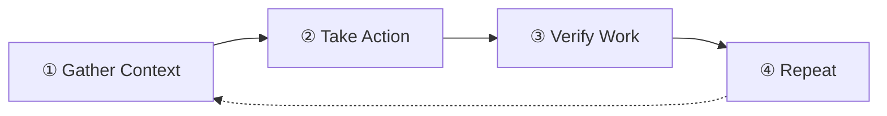
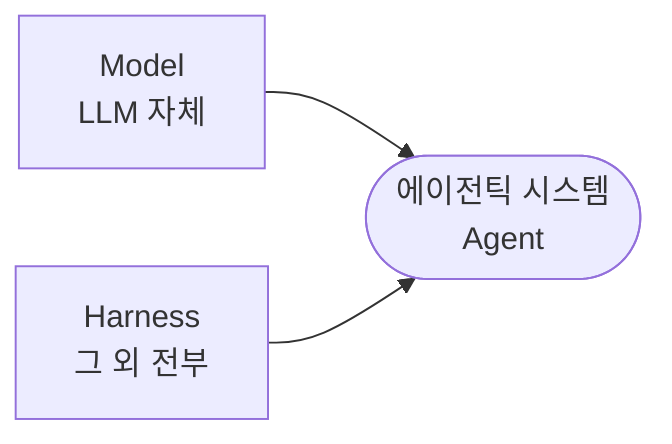
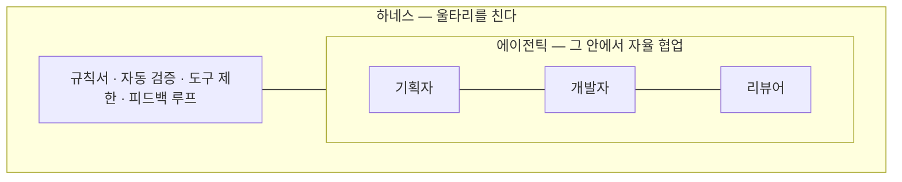

# 에이전틱과 하네스

> 발표 자료를 문서로 옮긴 것. 실전 적용은 [FE 에이전틱 하네스](../fe-harness.draft).

## AI 활용의 진화와 한계

---

### AI는 3단계로 발전해왔다

AI를 활용하는 방법은 지난 몇 년간 이렇게 발전해왔다. 각 단계는 별개가 아니라 **이전 단계를 포함하면서 쌓여간다.**

```
LEVEL 1.  프롬프트 엔지니어링 (2023~)
          "모델에 무엇을 말할 것인가"
          → 단일 프롬프트, 정적

LEVEL 2.  컨텍스트 엔지니어링 (2025~)
          "모델에 무엇을 보여줄 것인가"
          → 입력 파이프라인 전체, 동적

LEVEL 3.  하네스 엔지니어링 (2026~)
          "모델 주변에 무엇을 구축할 것인가"
          → 실행 환경 전체, 시스템 아키텍처
```

중요한 건 **안쪽(프롬프트)이 부실하면 바깥(하네스)도 부실**하다는 것이다. 프롬프트가 모호하면, 그 위에 아무리 정교한 컨텍스트를 쌓고 하네스를 만들어도 근본 문제가 해결되지 않는다. Level 1이 흡수된 채로 Level 3까지 올라가는 것이지, 이전 단계를 버리고 올라가는 게 아니다.

> "프롬프트 엔지니어링은 사라진 게 아니라 흡수된 것이다. 좋은 컨텍스트 엔지니어는 여전히 좋은 프롬프트 엔지니어다."

---

### 좋은 프롬프트로도 해결 안 되는 문제

AI한테 "이렇게 해줘"라고 아무리 잘 말해도 두 가지 문제가 남는다.

**재현성 문제** — 같은 프롬프트를 줘도 매번 다른 결과가 나온다. LLM은 비결정적(non-deterministic) 시스템이다.

**복리로 쌓이는 실패** — 한 단계에서 5%만 실패해도, 단계가 쌓이면 치명적이다.

```
각 단계 성공률 95% (꽤 잘하는 AI)
20단계 체인을 거치면?

0.95²⁰ = 0.358 → 약 36%

"95% 동작하는" 에이전트가 실제 작업의 2/3에서 실패한다.
```

프롬프트를 잘 쓰는 것만으로는 이 구조적 문제가 해결되지 않는다. 두 가지 방향의 접근이 필요하다:

- **AI를 더 자율적으로** — 스스로 계획하고 협업하고 개선하게 (= 에이전틱)
- **AI (주변)환경을 단단하게** — 실수할 수 없는 구조를 만들기 (= 하네스)

이 두 축을 하나씩 살펴본다.

---

## 에이전틱 — AI를 자율적으로 일하게 하기

---

### 먼저: 공식 정의부터 정리

> **"Agent = Model + Harness"** — LangChain, Vivek Trivedy

> **"모델이 아닌 것은 전부 하네스다."**

공식 관점에서 에이전틱과 하네스는 **대립 개념이 아니다**. 에이전틱은 "**AI가 자율적으로 일하는 시스템**"이라는 **상위 패러다임**이고, 하네스는 그걸 실현하는 **모델 외 모든 설계 요소**다. ~~역할 분리, 피드백 루프, 규칙 축적 같은 모든 설계는 공식적으로 전부 **하네스** 영역.~~

**하지만 이 발표에서는 편의상 두 프레이밍으로 나눠 설명한다:**

- **에이전틱 관점** — AI가 자율적으로 일하게 만드는 **능력/지향** 측면
- **하네스 관점** — 그 시스템을 안전하게 돌리기 위한 **구조적 설계/제약** 측면

둘은 실제로 겹치지만, 나눠서 보면 "무엇을 왜 만드는가"가 명확해진다.

---

### 정의

> **에이전틱 = AI가 스스로 "계획 → 실행 → 관찰 → 반복"을 돌리며 자율적으로 일하는 시스템**

핵심 키워드: **자율성(Autonomy)** — 매 단계마다 사람이 개입하지 않아도 AI가 스스로 판단하고 다음 행동을 결정한다.

---

### 도구 → 에이전트 → 에이전틱

AI를 쓰는 방식에도 단계가 있다.

```
도구 (Tool):
  사람: "이 오타 고쳐줘"
  AI: (시킨 그 오타만 고침)
  → 시킨 것만 한다. 판단은 사람이.

에이전트 (Agent):
  사람: "이 기능 구현해줘"
  AI: 프로젝트 살펴보기 → 비슷한 코드 찾기 → 판단 → 파일 생성 → 오류 수정
  → 스스로 계획하고, 판단하고, 실행하는 단일 주체.

에이전틱 (Agentic):
  여러 에이전트가 자율적으로 협업하는 시스템.
  기획 에이전트 → 개발 에이전트 → 리뷰 에이전트가 파일/피드백을 주고받으며 일한다.
  사람이 중간에 개입하지 않아도 다음 단계로 스스로 이어진다.
  → 자율 협업.
```

**비유:**

```
도구     = 드라이버 (사람이 어디에 쓸지 결정)
에이전트  = 수리기사 (뭘 고칠지 스스로 판단)
에이전틱  = 수리 팀 (기획자 + 수리기사 + 검수자가 자기들끼리 협업)
```

**Claude Code에 대응시키면:**

- 도구 = Read, Write, Bash 등 내장 기능
- 에이전트 = 메인 세션 또는 개별 sub-agent
- 에이전틱 = Task로 여러 sub-agent를 호출하여 협업시키는 구조

(Skill은 "도구"가 아니라 "컨텍스트 + 프롬프트 번들"이라 위 계층과는 축이 다르다.)

---

### 에이전틱의 두 축

**1. 자율 협업 — 여러 AI가 각자 역할로 협력**

기획 AI가 스펙을 쓰면, 개발 AI가 그걸 읽고 코드를 만든다. 리뷰 AI가 코드를 보고 피드백을 남기면, 개발 AI가 다시 수정한다. **사람이 손대지 않아도 AI들이 문서를 주고받으며 자기들끼리 돈다.**

왜 나누는가? 한 AI가 기획+개발+리뷰를 다 하면 정보 과부하에 자기 평가 편향까지 더해져 품질이 떨어진다. **"더 많은 AI"가 아니라 "더 좁은 역할의 AI 여럿"** 이 핵심.

**2. 반복(Iterate) — 한 번에 완벽하지 않아도 반복으로 품질이 올라간다**

AI는 처음부터 완벽하게 못 만든다. 리뷰어가 지적 → 개발자가 수정 → 다시 리뷰 → 또 수정. 이 반복(iterate)을 돌면서 점수가 오른다. 에이전틱의 핵심은 **이 반복이 사람 없이 AI들끼리 돌아간다는 것**.

---

### 에이전틱의 구조적 한계 — Self-Preference Bias (자기선호편향)

에이전트를 여러 개로 나누고 자율 협업시켜도, 한 가지 문제가 남는다. **바로 Self-Preference Bias(자기선호편향)다.**

> **Self-Preference Bias** — LLM은 자기가 생성한 출력을 다른 출력보다 유의미하게 높게 평가한다. (NeurIPS 2024, "LLM Evaluators Recognize and Favor Their Own Generations")

```
사람도 마찬가지:
  자기가 쓴 글을 자기가 교정 → 오타를 못 찾음
  자기가 만든 기획서를 자기가 검토 → "이게 최선이지" 합리화

AI도 마찬가지:
  자기가 만든 코드를 "검토해줘" → "잘 작성되었습니다" (거의 항상)
```

이건 "실수"가 아니라 **구조적 편향**이다. 프롬프트로 "엄격하게 평가해"라고 해도 해결되지 않는다. 그리고 중요한 점 — 이 편향은 **"역할을 나눴다"고 해결되지 않는다.** 같은 LLM을 쓰는 한 자기 출력을 알아보는 경향이 남기 때문.

**→ 에이전틱(자율 협업)만으로는 Self-Preference Bias를 구조적으로 막지 못한다. 그래서 하네스가 필요하다.**

어떻게 막는지는 「하네스」에서 구체적으로 다룬다 (역할 분리, 도구 제한, 검증 장치, 규칙 축적 등).

---

## 하네스 — AI가 안전하게 일할 수 있는 환경 만들기

---

### 왜 하네스인가 — 말 비유

AI는 엄청나게 강력한 말(Horse)이다.

```
이 말은:
  · 밭을 갈 수 있고
  · 통나무를 끌 수 있고
  · 사람이 못하는 무거운 짐을 운반할 수 있다.

그런데 이 말을 그냥 풀어놓으면?
  · 제멋대로 달린다
  · 밭이 아니라 옆집 정원을 밟는다
  · 힘이 세기 때문에 피해도 크다

말은 강력하지만, 제어하지 않으면 오히려 위험하다.
→ 고삐, 안장, 재갈 같은 마구(Harness)로 방향을 잡아줘야 한다.
```

LLM도 똑같다. 강력한 생성 능력은 있지만 제어 없이 쓰면 규칙을 어기고 잘못된 파일을 건드린다.

> **하네스 = 강력하지만 예측 불가능한 말(LLM)을 원하는(올바른) 방향으로 이끄는 장비 전체**

---

### 정의

> **하네스 = AI가 혼자서도 잘 일할 수 있는 작업 환경을 만드는 것**

> "If you're not the model, you're the harness." — Vivek Trivedy, LangChain

> "하네스의 모든 구성요소는 모델이 혼자서는 못 하는 것에 대한 가정을 담고 있다." — Anthropic

하네스는 AI가 작업할 때 **무엇을 보고, 무엇을 할 수 있고, 어떤 순서로, 어떻게 검증받는지**를 전부 설계하는 것이다. 프롬프트 하나가 아니라 실행 환경 전체.

---

### 하네스의 핵심 철학

> **AI가 규칙을 어겼을 때 "더 잘해봐"라고 프롬프트를 고치는 게 아니다.**  
> **그 실패가 구조적으로 반복 불가능하도록 "환경"을 고치는 것이다.**

```
일반적인 반응:
  AI가 규칙 위반 → 프롬프트에 "규칙 지켜" 추가 → 다음에 또 위반

하네스 엔지니어링:
  AI가 규칙 위반 → 자동 검사 규칙 추가 → 다음에 자동으로 걸림
```

프롬프트는 부탁이고, 하네스는 강제다.

---

### 6대 구성요소

하네스는 6개의 축으로 볼 수 있다. (LangChain, Martin Fowler 등 업계에서 정리한 프레임워크)


| 구성요소                    | 핵심 질문         | 설명                                                                                    |
| ----------------------- | ------------- | ------------------------------------------------------------------------------------- |
| **Context Engineering** | AI가 뭘 아는가     | 각 단계에서 모델이 보는 정보를 설계. 뭘 유지하고 뭘 버릴지 관리                                                 |
| **Tool Orchestration**  | AI가 뭘 할 수 있는가 | AI에게 허용/차단하는 **도구**를 결정 (Bash, Write, Edit, 다른 Agent 호출 등). 지휘자(Orchestrator)와는 다른 개념 |
| **Verification Loop**   | 결과를 어떻게 믿는가   | 출력 후 자동 검증. 타입/린트/테스트/정책 유효성                                                          |
| **Error Recovery**      | 실패하면 어떻게 하는가  | 실패 감지 → 재시도 / 다른 접근법 / 사람에게 에스컬레이션                                                    |
| **State & Memory**      | 기억을 어떻게 유지하는가 | 수 분~수 시간 실행되는 에이전트의 내구성 있는 상태 관리                                                      |
| **Human-in-the-Loop**   | 어디서 사람이 확인하는가 | 핵심 의사결정에서 일시 정지. "DB 삭제? 결제?" → 승인 요구                                                 |


---

### 4대 설계 원칙

어떤 패턴으로 하네스를 만들든 공통으로 지켜야 하는 원칙 네 가지.

**1. 컨텍스트 격리** — 각 에이전트는 자기 일에 필요한 것만 본다

전부 보여주면 정보 과부하로 중요한 걸 놓친다(Context Anxiety). 필요한 것만 주면 역할에 집중한다. 메인 에이전트는 결정과 요약만 다룬다.

**2. 역할 경계 명시** — "무엇을 하고 무엇을 안 하는지" 명시

모호하면 역할이 겹치거나(중복) 빈 곳이 생긴다(공백). 에이전트 정의에 DO/DON'T를 명시적으로 적는다.

**3. 검증 주체 분리** — 생성자 ≠ 검증자

앞서 설명한 **Self-Preference Bias**의 직접적 해결책. 자기가 만든 것을 자기가 검증하면 blind spot이 잔존한다. 별도의 검증 주체가 있어야 객관적 판단이 가능하다.

**4. 사전 모호성 제거** — 실행 후 발견하면 이미 늦다

바로 만들기 시작하면 "아 이게 아니었어?" 재작업이 발생한다. 실행 전에 질문으로 가정을 드러내야 한다. AI가 바로 코딩부터 시작하게 두지 말고, 명확해질 때까지 스펙을 쪼아야 한다.

---

### 에이전트 루프 — 하네스의 심장

거의 모든 AI 에이전트는 이 4단계를 반복한다. ~~Anthropic 공식 문서도 이 구조를 사용한다.~~ **하네스 엔지니어링은 이 4단계의 각 지점을 신뢰성 있게 만드는 작업이다.**




**① Gather Context (정보 수집)** — 파일 읽기, 검색, 질문

하네스 개입 지점: **필요한 것만 주고 노이즈는 걸러낸다.** 관련 없는 파일, 오래된 문서, 다른 에이전트의 사고 과정 등이 섞이면 AI가 엉뚱한 판단을 한다. 무조건 많이 주는 게 아니라 **이번 작업에 정확히 필요한 정보만** 주는 게 하네스의 첫 책임.

**② Take Action (작업 실행)** — 코드 작성, 명령 실행, 도구 호출

하네스 개입 지점: **어떤 도구를 쓸 수 있는지 제한한다.** 평가자에게 쓰기 도구를 주면 평가 대신 직접 수정해버린다(앞서 설명한 검증 주체 분리 원칙). 도구를 빼면 구조적으로 막힌다. 또 되돌릴 수 있는 행동 위주로 제한해서 실패 비용을 낮춘다.

**③ Verify Work (결과 검증)** — 린트, 타입 체크, 자동 테스트 실행, 리뷰

하네스 개입 지점: **자동 검증 장치를 건다.** 여기가 막히면 전체가 붕괴된다. AI에게 "괜찮아?"라고 묻는 건 Self-Preference Bias 때문에 의미가 없다. 기계적 검증(타입 체커, 린터, 테스트 러너)을 자동으로 돌려서 결정론적 합격/불합격을 낸다.

**④ Repeat (반복)** — 결과를 다음 루프의 컨텍스트로

하네스 개입 지점: **이전 결과가 다음에 잘 전달되는지 관리.** 이전 결과를 요약·정리(Compaction/Pruning)하지 않고 전부 넘기면 컨텍스트가 터진다. 실패했다면 에러 메시지를 다음 루프에 구조화해서 전달(Retry with Feedback).

그리고 여기서 **하네스의 자가진화**가 일어난다. 같은 실수가 반복되면 그 패턴을 감지해서 규칙으로 축적한다. 한번 당한 실수는 규칙이 되어 다음부터는 자동으로 막힌다. **"Post-Mortem → 한 줄 규칙"의 AI 버전.**

---

### 하네스의 실전 기법 4가지

위의 원칙과 루프를 **실제로 어떻게 구현하는가?** 업계에서 가장 널리 쓰이는 4가지 기법.

#### 1. 역할 분리 (Role Separation)

에이전트마다 하는 일을 명확히 나눈다. "이 에이전트는 기획만", "이 에이전트는 코드 작성만", "이 에이전트는 평가만".

```
예: Planner / Generator / Evaluator 3개로 분리
  - Planner = 스펙 작성만
  - Generator = 코드 구현만
  - Evaluator = 리뷰만
```

왜? 한 AI가 여러 역할을 하면 자기 평가 편향이 생김 (앞의 Self-Preference Bias).

#### 2. 피드백 루프 (Feedback Loop)

평가 결과를 다시 입력으로 넣어 반복 개선.

```
예: FAIL → feedback.md 작성 → Generator가 읽고 수정 → 재평가
  "변환 유틸 삭제하고 직접 전달하도록 변경"
  → Generator가 파일만 보고 수정 → 통과
```

핵심: 에이전트끼리 **대화**가 아니라 **문서**로 주고받는다. 의도/reasoning이 섞이면 관대해지기 때문.

#### 3. 규칙 축적 (Rule Accumulation)

**반복되는 실수가 "한 줄 규칙"으로 저장되어 다음 실행부터 자동 적용된다.** 하네스가 시간이 지날수록 단단해지는 구조.

```
예: "TDS v1 API를 v3 스타일로 호출하는 실수"가 반복됨
  → rules 파일에 추가: "AssetIcon은 Asset.Icon으로 호출"
  → 다음 하네스 실행 시 Generator가 이 규칙을 참조
  → 같은 실수 재발 없음
```

사람의 Post-Mortem과 같은 원리 — 사고의 재발을 막기 위해 규칙으로 남긴다.

#### 4. 도구 제한 (Tool Restriction)

**AI에게 허용/차단할 도구를 명시적으로 설정**한다. Claude Code에서는 `allowedTools` / `disallowedTools`로 관리.

```
예: Evaluator에게 도구 제한
  disallowedTools: [Write, Edit, Bash]
  → 코드 수정 도구를 물리적으로 박탈
  → "내가 고쳐줄게"가 불가능 → 평가에만 집중

예: Planner에게 도구 제한
  disallowedTools: [Bash]
  → 명령 실행 차단 → 분석/설계만 가능
```

프롬프트에 "고치지 마세요" 부탁하는 게 아니라 **도구를 빼서 구조적으로 차단**한다.

---

## 에이전틱과 하네스 — 둘은 어떻게 결합되는가

---

### 공식 정의: 포함 관계

「에이전틱」 서두에서 밝혔듯 공식 정의로는 둘이 **대립 관계가 아니라 포함 관계**다.




공식 분류로 Planner/Generator/Evaluator 역할 분리, 피드백 루프, 규칙 축적, 도구 제한 — **전부 Harness 영역**이다. Anthropic, LangChain, Martin Fowler 모두 이 구분에 일치한다.

---

### 결합 구조

두 축은 대립 관계가 아니라 **상호보완 관계**다. 둘 다 있어야 작동한다.



마구를 씌운 말 3마리가 각자 역할로 밭을 가는 것.


하네스가 울타리를 치고, 그 안에서 에이전트들이 자율적으로 협업한다.
마구를 씌운 말 3마리가 각자 역할로 밭을 가는 것.


- **에이전틱만 있고 하네스가 없으면:** 말이 제멋대로 달린다. Self-Preference Bias로 품질이 보장 안 됨.
- **하네스만 있고 에이전틱이 없으면:** 규칙만 있고 실행이 없다. 결국 사람이 다 해야 함.
- **둘이 결합되면:** AI가 자율적으로 일하면서도, 잘못할 수 없는 환경 안에서 돈다. **이게 진짜 자동화.**

---

---

### 참고 자료

- Anthropic, "Harness design for long-running application development"
- LangChain, Vivek Trivedy, "The Anatomy of an Agent Harness"
- Martin Fowler, "Harness Engineering"
- NeurIPS 2024, "LLM Evaluators Recognize and Favor Their Own Generations" (Self-Preference Bias)
- Kai Renner, harness-engineering.ai
